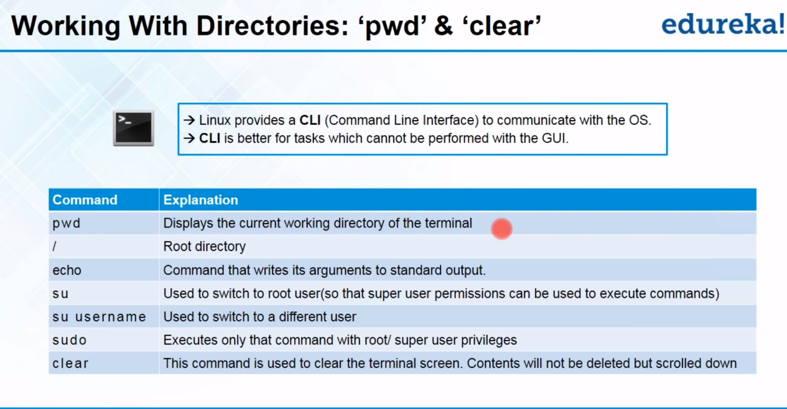

# Linux World

## Linux High level understanding





* Cat Command use 1
```ssh
jdublnx@JDUBUNTO:~$ cd Documents/
jdublnx@JDUBUNTO:~/Documents$ ls
file1.txt
jdublnx@JDUBUNTO:~/Documents$ cat file1.txt 
total 100
drwxr-xr-x 16 jdublnx jdublnx 4096  4月 22 11:15 .
drwxr-xr-x  3 root    root    4096  4月 21 14:04 ..
drwxr-xr-x 13 jdublnx jdublnx 4096  4月 21 16:11 .cache
drwx------ 11 jdublnx jdublnx 4096  4月 21 14:25 .config
drwxr-xr-x  2 jdublnx jdublnx 4096  4月 22 09:25 Desktop
drwxr-xr-x  2 jdublnx jdublnx 4096  4月 22 11:25 Documents
drwxr-xr-x  2 jdublnx jdublnx 4096  4月 21 14:13 Downloads
drwx------  3 jdublnx jdublnx 4096  4月 21 14:14 .gnupg
drwxr-xr-x  3 jdublnx jdublnx 4096  4月 21 14:13 .local
drwx------  4 jdublnx jdublnx 4096  4月 21 14:19 .mozilla
drwxr-xr-x  2 jdublnx jdublnx 4096  4月 21 14:13 Music
drwxr-xr-x  2 jdublnx jdublnx 4096  4月 21 14:13 Pictures
drwxr-xr-x  2 jdublnx jdublnx 4096  4月 21 14:13 Public
drwx------  2 jdublnx jdublnx 4096  4月 21 14:14 .ssh
drwxr-xr-x  2 jdublnx jdublnx 4096  4月 21 14:13 Templates
drwxr-xr-x  2 jdublnx jdublnx 4096  4月 21 14:13 Videos
-rw-r--r--  1 jdublnx jdublnx 3771  4月 21 14:04 .bashrc
-rw-rw-rw-  1 jdublnx jdublnx 1929  4月 22 11:15 Install_CentOS_in_VM.md
-rw-r--r--  1 jdublnx jdublnx  807  4月 21 14:04 .profile
-rw-------  1 jdublnx jdublnx  378  4月 22 09:47 .bash_history
-rw-r--r--  1 jdublnx jdublnx  220  4月 21 14:04 .bash_logout
-rw-r-----  1 jdublnx jdublnx    5  4月 22 09:12 .vboxclient-clipboard.pid
-rw-r-----  1 jdublnx jdublnx    5  4月 22 09:12 .vboxclient-display-svga-x11.pid
-rw-r-----  1 jdublnx jdublnx    5  4月 22 09:12 .vboxclient-draganddrop.pid
-rw-r-----  1 jdublnx jdublnx    5  4月 22 09:12 .vboxclient-seamless.pid
-rw-r--r--  1 jdublnx jdublnx    0  4月 21 14:17 .sudo_as_admin_successful
jdublnx@JDUBUNTO:~/Documents$ cat > file2.txt
hi my name is jd
welcome to linux world 
jdublnx@JDUBUNTO:~/Documents$ cat file2.txt 
hi my name is jd
welcome to linux world
jdublnx@JDUBUNTO:~/Documents$ cat file1.txt 
total 100
drwxr-xr-x 16 jdublnx jdublnx 4096  4月 22 11:15 .
drwxr-xr-x  3 root    root    4096  4月 21 14:04 ..
drwxr-xr-x 13 jdublnx jdublnx 4096  4月 21 16:11 .cache
drwx------ 11 jdublnx jdublnx 4096  4月 21 14:25 .config
drwxr-xr-x  2 jdublnx jdublnx 4096  4月 22 09:25 Desktop
drwxr-xr-x  2 jdublnx jdublnx 4096  4月 22 11:25 Documents
drwxr-xr-x  2 jdublnx jdublnx 4096  4月 21 14:13 Downloads
drwx------  3 jdublnx jdublnx 4096  4月 21 14:14 .gnupg
drwxr-xr-x  3 jdublnx jdublnx 4096  4月 21 14:13 .local
drwx------  4 jdublnx jdublnx 4096  4月 21 14:19 .mozilla
drwxr-xr-x  2 jdublnx jdublnx 4096  4月 21 14:13 Music
drwxr-xr-x  2 jdublnx jdublnx 4096  4月 21 14:13 Pictures
drwxr-xr-x  2 jdublnx jdublnx 4096  4月 21 14:13 Public
drwx------  2 jdublnx jdublnx 4096  4月 21 14:14 .ssh
drwxr-xr-x  2 jdublnx jdublnx 4096  4月 21 14:13 Templates
drwxr-xr-x  2 jdublnx jdublnx 4096  4月 21 14:13 Videos
-rw-r--r--  1 jdublnx jdublnx 3771  4月 21 14:04 .bashrc
-rw-rw-rw-  1 jdublnx jdublnx 1929  4月 22 11:15 Install_CentOS_in_VM.md
-rw-r--r--  1 jdublnx jdublnx  807  4月 21 14:04 .profile
-rw-------  1 jdublnx jdublnx  378  4月 22 09:47 .bash_history
-rw-r--r--  1 jdublnx jdublnx  220  4月 21 14:04 .bash_logout
-rw-r-----  1 jdublnx jdublnx    5  4月 22 09:12 .vboxclient-clipboard.pid
-rw-r-----  1 jdublnx jdublnx    5  4月 22 09:12 .vboxclient-display-svga-x11.pid
-rw-r-----  1 jdublnx jdublnx    5  4月 22 09:12 .vboxclient-draganddrop.pid
-rw-r-----  1 jdublnx jdublnx    5  4月 22 09:12 .vboxclient-seamless.pid
-rw-r--r--  1 jdublnx jdublnx    0  4月 21 14:17 .sudo_as_admin_successful
jdublnx@JDUBUNTO:~/Documents$ cat file1.txt file2.txt 
total 100
drwxr-xr-x 16 jdublnx jdublnx 4096  4月 22 11:15 .
drwxr-xr-x  3 root    root    4096  4月 21 14:04 ..
drwxr-xr-x 13 jdublnx jdublnx 4096  4月 21 16:11 .cache
drwx------ 11 jdublnx jdublnx 4096  4月 21 14:25 .config
drwxr-xr-x  2 jdublnx jdublnx 4096  4月 22 09:25 Desktop
drwxr-xr-x  2 jdublnx jdublnx 4096  4月 22 11:25 Documents
drwxr-xr-x  2 jdublnx jdublnx 4096  4月 21 14:13 Downloads
drwx------  3 jdublnx jdublnx 4096  4月 21 14:14 .gnupg
drwxr-xr-x  3 jdublnx jdublnx 4096  4月 21 14:13 .local
drwx------  4 jdublnx jdublnx 4096  4月 21 14:19 .mozilla
drwxr-xr-x  2 jdublnx jdublnx 4096  4月 21 14:13 Music
drwxr-xr-x  2 jdublnx jdublnx 4096  4月 21 14:13 Pictures
drwxr-xr-x  2 jdublnx jdublnx 4096  4月 21 14:13 Public
drwx------  2 jdublnx jdublnx 4096  4月 21 14:14 .ssh
drwxr-xr-x  2 jdublnx jdublnx 4096  4月 21 14:13 Templates
drwxr-xr-x  2 jdublnx jdublnx 4096  4月 21 14:13 Videos
-rw-r--r--  1 jdublnx jdublnx 3771  4月 21 14:04 .bashrc
-rw-rw-rw-  1 jdublnx jdublnx 1929  4月 22 11:15 Install_CentOS_in_VM.md
-rw-r--r--  1 jdublnx jdublnx  807  4月 21 14:04 .profile
-rw-------  1 jdublnx jdublnx  378  4月 22 09:47 .bash_history
-rw-r--r--  1 jdublnx jdublnx  220  4月 21 14:04 .bash_logout
-rw-r-----  1 jdublnx jdublnx    5  4月 22 09:12 .vboxclient-clipboard.pid
-rw-r-----  1 jdublnx jdublnx    5  4月 22 09:12 .vboxclient-display-svga-x11.pid
-rw-r-----  1 jdublnx jdublnx    5  4月 22 09:12 .vboxclient-draganddrop.pid
-rw-r-----  1 jdublnx jdublnx    5  4月 22 09:12 .vboxclient-seamless.pid
-rw-r--r--  1 jdublnx jdublnx    0  4月 21 14:17 .sudo_as_admin_successful
hi my name is jd
welcome to linux world
jdublnx@JDUBUNTO:~/Documents$ cat file1.txt >> file2.txt 
jdublnx@JDUBUNTO:~/Documents$ cat file2.txt 
hi my name is jd
welcome to linux world
total 100
drwxr-xr-x 16 jdublnx jdublnx 4096  4月 22 11:15 .
drwxr-xr-x  3 root    root    4096  4月 21 14:04 ..
drwxr-xr-x 13 jdublnx jdublnx 4096  4月 21 16:11 .cache
drwx------ 11 jdublnx jdublnx 4096  4月 21 14:25 .config
drwxr-xr-x  2 jdublnx jdublnx 4096  4月 22 09:25 Desktop
drwxr-xr-x  2 jdublnx jdublnx 4096  4月 22 11:25 Documents
drwxr-xr-x  2 jdublnx jdublnx 4096  4月 21 14:13 Downloads
drwx------  3 jdublnx jdublnx 4096  4月 21 14:14 .gnupg
drwxr-xr-x  3 jdublnx jdublnx 4096  4月 21 14:13 .local
drwx------  4 jdublnx jdublnx 4096  4月 21 14:19 .mozilla
drwxr-xr-x  2 jdublnx jdublnx 4096  4月 21 14:13 Music
drwxr-xr-x  2 jdublnx jdublnx 4096  4月 21 14:13 Pictures
drwxr-xr-x  2 jdublnx jdublnx 4096  4月 21 14:13 Public
drwx------  2 jdublnx jdublnx 4096  4月 21 14:14 .ssh
drwxr-xr-x  2 jdublnx jdublnx 4096  4月 21 14:13 Templates
drwxr-xr-x  2 jdublnx jdublnx 4096  4月 21 14:13 Videos
-rw-r--r--  1 jdublnx jdublnx 3771  4月 21 14:04 .bashrc
-rw-rw-rw-  1 jdublnx jdublnx 1929  4月 22 11:15 Install_CentOS_in_VM.md
-rw-r--r--  1 jdublnx jdublnx  807  4月 21 14:04 .profile
-rw-------  1 jdublnx jdublnx  378  4月 22 09:47 .bash_history
-rw-r--r--  1 jdublnx jdublnx  220  4月 21 14:04 .bash_logout
-rw-r-----  1 jdublnx jdublnx    5  4月 22 09:12 .vboxclient-clipboard.pid
-rw-r-----  1 jdublnx jdublnx    5  4月 22 09:12 .vboxclient-display-svga-x11.pid
-rw-r-----  1 jdublnx jdublnx    5  4月 22 09:12 .vboxclient-draganddrop.pid
-rw-r-----  1 jdublnx jdublnx    5  4月 22 09:12 .vboxclient-seamless.pid
-rw-r--r--  1 jdublnx jdublnx    0  4月 21 14:17 .sudo_as_admin_successful
jdublnx@JDUBUNTO:~/Documents$ ^C

```

* Cat Command use 2
```linux
jdublnx@JDUBUNTO:~/Documents$ cat -n file2.txt 
     1	hi my name is jd
     2	welcome to linux world
     3	total 100
     4	drwxr-xr-x 16 jdublnx jdublnx 4096  4月 22 11:15 .
     5	drwxr-xr-x  3 root    root    4096  4月 21 14:04 ..
     6	drwxr-xr-x 13 jdublnx jdublnx 4096  4月 21 16:11 .cache
     7	drwx------ 11 jdublnx jdublnx 4096  4月 21 14:25 .config
     8	drwxr-xr-x  2 jdublnx jdublnx 4096  4月 22 09:25 Desktop
     9	drwxr-xr-x  2 jdublnx jdublnx 4096  4月 22 11:25 Documents
    10	drwxr-xr-x  2 jdublnx jdublnx 4096  4月 21 14:13 Downloads
    11	drwx------  3 jdublnx jdublnx 4096  4月 21 14:14 .gnupg
    12	drwxr-xr-x  3 jdublnx jdublnx 4096  4月 21 14:13 .local
    13	drwx------  4 jdublnx jdublnx 4096  4月 21 14:19 .mozilla
    14	drwxr-xr-x  2 jdublnx jdublnx 4096  4月 21 14:13 Music
    15	drwxr-xr-x  2 jdublnx jdublnx 4096  4月 21 14:13 Pictures
    16	drwxr-xr-x  2 jdublnx jdublnx 4096  4月 21 14:13 Public
    17	drwx------  2 jdublnx jdublnx 4096  4月 21 14:14 .ssh
    18	drwxr-xr-x  2 jdublnx jdublnx 4096  4月 21 14:13 Templates
    19	drwxr-xr-x  2 jdublnx jdublnx 4096  4月 21 14:13 Videos
    20	-rw-r--r--  1 jdublnx jdublnx 3771  4月 21 14:04 .bashrc
    21	-rw-rw-rw-  1 jdublnx jdublnx 1929  4月 22 11:15 Install_CentOS_in_VM.md
    22	-rw-r--r--  1 jdublnx jdublnx  807  4月 21 14:04 .profile
    23	-rw-------  1 jdublnx jdublnx  378  4月 22 09:47 .bash_history
    24	-rw-r--r--  1 jdublnx jdublnx  220  4月 21 14:04 .bash_logout
    25	-rw-r-----  1 jdublnx jdublnx    5  4月 22 09:12 .vboxclient-clipboard.pid
    26	-rw-r-----  1 jdublnx jdublnx    5  4月 22 09:12 .vboxclient-display-svga-x11.pid
    27	-rw-r-----  1 jdublnx jdublnx    5  4月 22 09:12 .vboxclient-draganddrop.pid
    28	-rw-r-----  1 jdublnx jdublnx    5  4月 22 09:12 .vboxclient-seamless.pid
    29	-rw-r--r--  1 jdublnx jdublnx    0  4月 21 14:17 .sudo_as_admin_successful
jdublnx@JDUBUNTO:~/Documents$ cat -b file2.txt 
     1	hi my name is jd
     2	welcome to linux world
     3	total 100
     4	drwxr-xr-x 16 jdublnx jdublnx 4096  4月 22 11:15 .
     5	drwxr-xr-x  3 root    root    4096  4月 21 14:04 ..
     6	drwxr-xr-x 13 jdublnx jdublnx 4096  4月 21 16:11 .cache
     7	drwx------ 11 jdublnx jdublnx 4096  4月 21 14:25 .config
     8	drwxr-xr-x  2 jdublnx jdublnx 4096  4月 22 09:25 Desktop
     9	drwxr-xr-x  2 jdublnx jdublnx 4096  4月 22 11:25 Documents
    10	drwxr-xr-x  2 jdublnx jdublnx 4096  4月 21 14:13 Downloads
    11	drwx------  3 jdublnx jdublnx 4096  4月 21 14:14 .gnupg
    12	drwxr-xr-x  3 jdublnx jdublnx 4096  4月 21 14:13 .local
    13	drwx------  4 jdublnx jdublnx 4096  4月 21 14:19 .mozilla
    14	drwxr-xr-x  2 jdublnx jdublnx 4096  4月 21 14:13 Music
    15	drwxr-xr-x  2 jdublnx jdublnx 4096  4月 21 14:13 Pictures
    16	drwxr-xr-x  2 jdublnx jdublnx 4096  4月 21 14:13 Public
    17	drwx------  2 jdublnx jdublnx 4096  4月 21 14:14 .ssh
    18	drwxr-xr-x  2 jdublnx jdublnx 4096  4月 21 14:13 Templates
    19	drwxr-xr-x  2 jdublnx jdublnx 4096  4月 21 14:13 Videos
    20	-rw-r--r--  1 jdublnx jdublnx 3771  4月 21 14:04 .bashrc
    21	-rw-rw-rw-  1 jdublnx jdublnx 1929  4月 22 11:15 Install_CentOS_in_VM.md
    22	-rw-r--r--  1 jdublnx jdublnx  807  4月 21 14:04 .profile
    23	-rw-------  1 jdublnx jdublnx  378  4月 22 09:47 .bash_history
    24	-rw-r--r--  1 jdublnx jdublnx  220  4月 21 14:04 .bash_logout
    25	-rw-r-----  1 jdublnx jdublnx    5  4月 22 09:12 .vboxclient-clipboard.pid
    26	-rw-r-----  1 jdublnx jdublnx    5  4月 22 09:12 .vboxclient-display-svga-x11.pid
    27	-rw-r-----  1 jdublnx jdublnx    5  4月 22 09:12 .vboxclient-draganddrop.pid
    28	-rw-r-----  1 jdublnx jdublnx    5  4月 22 09:12 .vboxclient-seamless.pid
    29	-rw-r--r--  1 jdublnx jdublnx    0  4月 21 14:17 .sudo_as_admin_successful
jdublnx@JDUBUNTO:~/Documents$ vi file2.txt 
jdublnx@JDUBUNTO:~/Documents$ 
```

