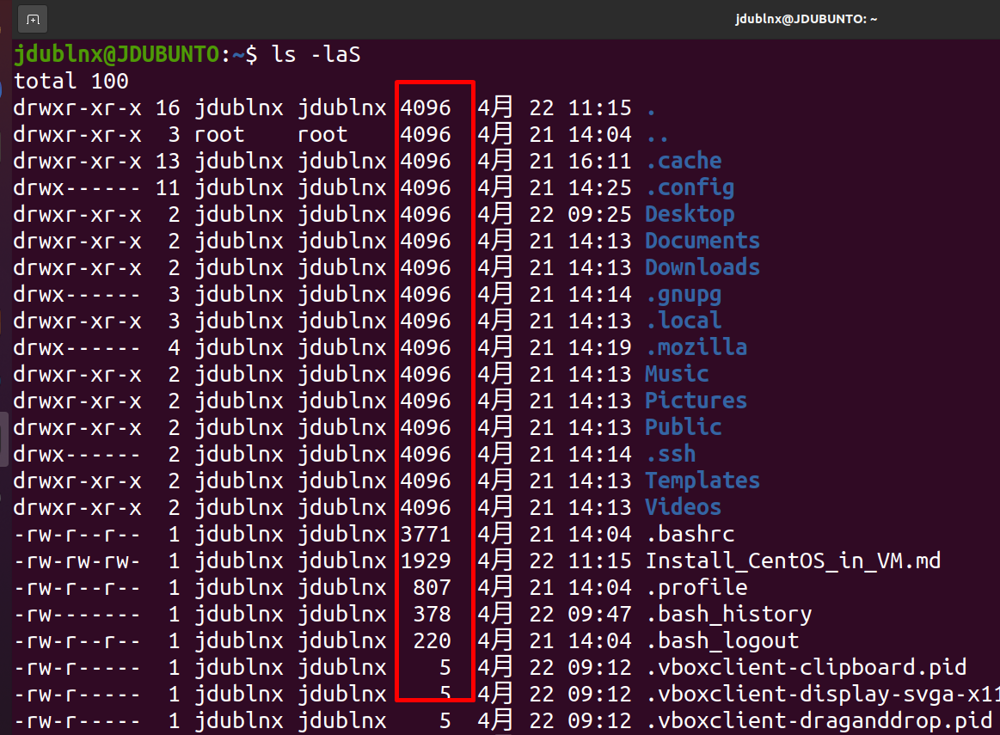
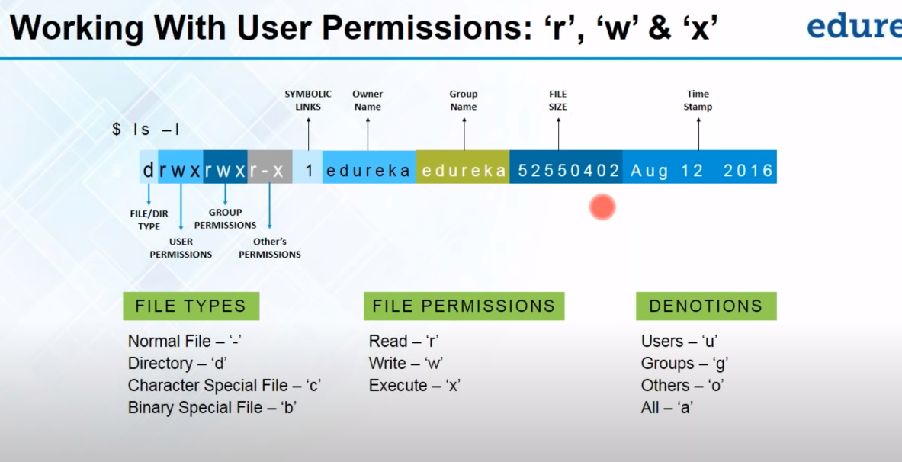

# Linux World

## Linux High level understanding

### Linux Introduction

---
### Linux Distributions

---
### Linux Features

---
### Basic Commands PWD and clear


---
### ls commands




---
### cd commands


---
### cat commands


* Cat Command use 1
```ssh
jdublnx@JDUBUNTO:~$ cd Documents/
jdublnx@JDUBUNTO:~/Documents$ ls
file1.txt
jdublnx@JDUBUNTO:~/Documents$ cat file1.txt 
total 100
drwxr-xr-x 16 jdublnx jdublnx 4096  4月 22 11:15 .
drwxr-xr-x  3 root    root    4096  4月 21 14:04 ..
drwxr-xr-x 13 jdublnx jdublnx 4096  4月 21 16:11 .cache
drwx------ 11 jdublnx jdublnx 4096  4月 21 14:25 .config
drwxr-xr-x  2 jdublnx jdublnx 4096  4月 22 09:25 Desktop
drwxr-xr-x  2 jdublnx jdublnx 4096  4月 22 11:25 Documents
drwxr-xr-x  2 jdublnx jdublnx 4096  4月 21 14:13 Downloads
drwx------  3 jdublnx jdublnx 4096  4月 21 14:14 .gnupg
drwxr-xr-x  3 jdublnx jdublnx 4096  4月 21 14:13 .local
drwx------  4 jdublnx jdublnx 4096  4月 21 14:19 .mozilla
drwxr-xr-x  2 jdublnx jdublnx 4096  4月 21 14:13 Music
drwxr-xr-x  2 jdublnx jdublnx 4096  4月 21 14:13 Pictures
drwxr-xr-x  2 jdublnx jdublnx 4096  4月 21 14:13 Public
drwx------  2 jdublnx jdublnx 4096  4月 21 14:14 .ssh
drwxr-xr-x  2 jdublnx jdublnx 4096  4月 21 14:13 Templates
drwxr-xr-x  2 jdublnx jdublnx 4096  4月 21 14:13 Videos
-rw-r--r--  1 jdublnx jdublnx 3771  4月 21 14:04 .bashrc
-rw-rw-rw-  1 jdublnx jdublnx 1929  4月 22 11:15 Install_CentOS_in_VM.md
-rw-r--r--  1 jdublnx jdublnx  807  4月 21 14:04 .profile
-rw-------  1 jdublnx jdublnx  378  4月 22 09:47 .bash_history
-rw-r--r--  1 jdublnx jdublnx  220  4月 21 14:04 .bash_logout
-rw-r-----  1 jdublnx jdublnx    5  4月 22 09:12 .vboxclient-clipboard.pid
-rw-r-----  1 jdublnx jdublnx    5  4月 22 09:12 .vboxclient-display-svga-x11.pid
-rw-r-----  1 jdublnx jdublnx    5  4月 22 09:12 .vboxclient-draganddrop.pid
-rw-r-----  1 jdublnx jdublnx    5  4月 22 09:12 .vboxclient-seamless.pid
-rw-r--r--  1 jdublnx jdublnx    0  4月 21 14:17 .sudo_as_admin_successful
jdublnx@JDUBUNTO:~/Documents$ cat > file2.txt
hi my name is jd
welcome to linux world 
jdublnx@JDUBUNTO:~/Documents$ cat file2.txt 
hi my name is jd
welcome to linux world
jdublnx@JDUBUNTO:~/Documents$ cat file1.txt 
total 100
drwxr-xr-x 16 jdublnx jdublnx 4096  4月 22 11:15 .
drwxr-xr-x  3 root    root    4096  4月 21 14:04 ..
drwxr-xr-x 13 jdublnx jdublnx 4096  4月 21 16:11 .cache
drwx------ 11 jdublnx jdublnx 4096  4月 21 14:25 .config
drwxr-xr-x  2 jdublnx jdublnx 4096  4月 22 09:25 Desktop
drwxr-xr-x  2 jdublnx jdublnx 4096  4月 22 11:25 Documents
drwxr-xr-x  2 jdublnx jdublnx 4096  4月 21 14:13 Downloads
drwx------  3 jdublnx jdublnx 4096  4月 21 14:14 .gnupg
drwxr-xr-x  3 jdublnx jdublnx 4096  4月 21 14:13 .local
drwx------  4 jdublnx jdublnx 4096  4月 21 14:19 .mozilla
drwxr-xr-x  2 jdublnx jdublnx 4096  4月 21 14:13 Music
drwxr-xr-x  2 jdublnx jdublnx 4096  4月 21 14:13 Pictures
drwxr-xr-x  2 jdublnx jdublnx 4096  4月 21 14:13 Public
drwx------  2 jdublnx jdublnx 4096  4月 21 14:14 .ssh
drwxr-xr-x  2 jdublnx jdublnx 4096  4月 21 14:13 Templates
drwxr-xr-x  2 jdublnx jdublnx 4096  4月 21 14:13 Videos
-rw-r--r--  1 jdublnx jdublnx 3771  4月 21 14:04 .bashrc
-rw-rw-rw-  1 jdublnx jdublnx 1929  4月 22 11:15 Install_CentOS_in_VM.md
-rw-r--r--  1 jdublnx jdublnx  807  4月 21 14:04 .profile
-rw-------  1 jdublnx jdublnx  378  4月 22 09:47 .bash_history
-rw-r--r--  1 jdublnx jdublnx  220  4月 21 14:04 .bash_logout
-rw-r-----  1 jdublnx jdublnx    5  4月 22 09:12 .vboxclient-clipboard.pid
-rw-r-----  1 jdublnx jdublnx    5  4月 22 09:12 .vboxclient-display-svga-x11.pid
-rw-r-----  1 jdublnx jdublnx    5  4月 22 09:12 .vboxclient-draganddrop.pid
-rw-r-----  1 jdublnx jdublnx    5  4月 22 09:12 .vboxclient-seamless.pid
-rw-r--r--  1 jdublnx jdublnx    0  4月 21 14:17 .sudo_as_admin_successful
jdublnx@JDUBUNTO:~/Documents$ cat file1.txt file2.txt 
total 100
drwxr-xr-x 16 jdublnx jdublnx 4096  4月 22 11:15 .
drwxr-xr-x  3 root    root    4096  4月 21 14:04 ..
drwxr-xr-x 13 jdublnx jdublnx 4096  4月 21 16:11 .cache
drwx------ 11 jdublnx jdublnx 4096  4月 21 14:25 .config
drwxr-xr-x  2 jdublnx jdublnx 4096  4月 22 09:25 Desktop
drwxr-xr-x  2 jdublnx jdublnx 4096  4月 22 11:25 Documents
drwxr-xr-x  2 jdublnx jdublnx 4096  4月 21 14:13 Downloads
drwx------  3 jdublnx jdublnx 4096  4月 21 14:14 .gnupg
drwxr-xr-x  3 jdublnx jdublnx 4096  4月 21 14:13 .local
drwx------  4 jdublnx jdublnx 4096  4月 21 14:19 .mozilla
drwxr-xr-x  2 jdublnx jdublnx 4096  4月 21 14:13 Music
drwxr-xr-x  2 jdublnx jdublnx 4096  4月 21 14:13 Pictures
drwxr-xr-x  2 jdublnx jdublnx 4096  4月 21 14:13 Public
drwx------  2 jdublnx jdublnx 4096  4月 21 14:14 .ssh
drwxr-xr-x  2 jdublnx jdublnx 4096  4月 21 14:13 Templates
drwxr-xr-x  2 jdublnx jdublnx 4096  4月 21 14:13 Videos
-rw-r--r--  1 jdublnx jdublnx 3771  4月 21 14:04 .bashrc
-rw-rw-rw-  1 jdublnx jdublnx 1929  4月 22 11:15 Install_CentOS_in_VM.md
-rw-r--r--  1 jdublnx jdublnx  807  4月 21 14:04 .profile
-rw-------  1 jdublnx jdublnx  378  4月 22 09:47 .bash_history
-rw-r--r--  1 jdublnx jdublnx  220  4月 21 14:04 .bash_logout
-rw-r-----  1 jdublnx jdublnx    5  4月 22 09:12 .vboxclient-clipboard.pid
-rw-r-----  1 jdublnx jdublnx    5  4月 22 09:12 .vboxclient-display-svga-x11.pid
-rw-r-----  1 jdublnx jdublnx    5  4月 22 09:12 .vboxclient-draganddrop.pid
-rw-r-----  1 jdublnx jdublnx    5  4月 22 09:12 .vboxclient-seamless.pid
-rw-r--r--  1 jdublnx jdublnx    0  4月 21 14:17 .sudo_as_admin_successful
hi my name is jd
welcome to linux world
jdublnx@JDUBUNTO:~/Documents$ cat file1.txt >> file2.txt 
jdublnx@JDUBUNTO:~/Documents$ cat file2.txt 
hi my name is jd
welcome to linux world
total 100
drwxr-xr-x 16 jdublnx jdublnx 4096  4月 22 11:15 .
drwxr-xr-x  3 root    root    4096  4月 21 14:04 ..
drwxr-xr-x 13 jdublnx jdublnx 4096  4月 21 16:11 .cache
drwx------ 11 jdublnx jdublnx 4096  4月 21 14:25 .config
drwxr-xr-x  2 jdublnx jdublnx 4096  4月 22 09:25 Desktop
drwxr-xr-x  2 jdublnx jdublnx 4096  4月 22 11:25 Documents
drwxr-xr-x  2 jdublnx jdublnx 4096  4月 21 14:13 Downloads
drwx------  3 jdublnx jdublnx 4096  4月 21 14:14 .gnupg
drwxr-xr-x  3 jdublnx jdublnx 4096  4月 21 14:13 .local
drwx------  4 jdublnx jdublnx 4096  4月 21 14:19 .mozilla
drwxr-xr-x  2 jdublnx jdublnx 4096  4月 21 14:13 Music
drwxr-xr-x  2 jdublnx jdublnx 4096  4月 21 14:13 Pictures
drwxr-xr-x  2 jdublnx jdublnx 4096  4月 21 14:13 Public
drwx------  2 jdublnx jdublnx 4096  4月 21 14:14 .ssh
drwxr-xr-x  2 jdublnx jdublnx 4096  4月 21 14:13 Templates
drwxr-xr-x  2 jdublnx jdublnx 4096  4月 21 14:13 Videos
-rw-r--r--  1 jdublnx jdublnx 3771  4月 21 14:04 .bashrc
-rw-rw-rw-  1 jdublnx jdublnx 1929  4月 22 11:15 Install_CentOS_in_VM.md
-rw-r--r--  1 jdublnx jdublnx  807  4月 21 14:04 .profile
-rw-------  1 jdublnx jdublnx  378  4月 22 09:47 .bash_history
-rw-r--r--  1 jdublnx jdublnx  220  4月 21 14:04 .bash_logout
-rw-r-----  1 jdublnx jdublnx    5  4月 22 09:12 .vboxclient-clipboard.pid
-rw-r-----  1 jdublnx jdublnx    5  4月 22 09:12 .vboxclient-display-svga-x11.pid
-rw-r-----  1 jdublnx jdublnx    5  4月 22 09:12 .vboxclient-draganddrop.pid
-rw-r-----  1 jdublnx jdublnx    5  4月 22 09:12 .vboxclient-seamless.pid
-rw-r--r--  1 jdublnx jdublnx    0  4月 21 14:17 .sudo_as_admin_successful
jdublnx@JDUBUNTO:~/Documents$ ^C

```

* Cat Command use 2
```linux
jdublnx@JDUBUNTO:~/Documents$ cat -n file2.txt 
     1	hi my name is jd
     2	welcome to linux world
     3	total 100
     4	drwxr-xr-x 16 jdublnx jdublnx 4096  4月 22 11:15 .
     5	drwxr-xr-x  3 root    root    4096  4月 21 14:04 ..
     6	drwxr-xr-x 13 jdublnx jdublnx 4096  4月 21 16:11 .cache
     7	drwx------ 11 jdublnx jdublnx 4096  4月 21 14:25 .config
     8	drwxr-xr-x  2 jdublnx jdublnx 4096  4月 22 09:25 Desktop
     9	drwxr-xr-x  2 jdublnx jdublnx 4096  4月 22 11:25 Documents
    10	drwxr-xr-x  2 jdublnx jdublnx 4096  4月 21 14:13 Downloads
    11	drwx------  3 jdublnx jdublnx 4096  4月 21 14:14 .gnupg
    12	drwxr-xr-x  3 jdublnx jdublnx 4096  4月 21 14:13 .local
    13	drwx------  4 jdublnx jdublnx 4096  4月 21 14:19 .mozilla
    14	drwxr-xr-x  2 jdublnx jdublnx 4096  4月 21 14:13 Music
    15	drwxr-xr-x  2 jdublnx jdublnx 4096  4月 21 14:13 Pictures
    16	drwxr-xr-x  2 jdublnx jdublnx 4096  4月 21 14:13 Public
    17	drwx------  2 jdublnx jdublnx 4096  4月 21 14:14 .ssh
    18	drwxr-xr-x  2 jdublnx jdublnx 4096  4月 21 14:13 Templates
    19	drwxr-xr-x  2 jdublnx jdublnx 4096  4月 21 14:13 Videos
    20	-rw-r--r--  1 jdublnx jdublnx 3771  4月 21 14:04 .bashrc
    21	-rw-rw-rw-  1 jdublnx jdublnx 1929  4月 22 11:15 Install_CentOS_in_VM.md
    22	-rw-r--r--  1 jdublnx jdublnx  807  4月 21 14:04 .profile
    23	-rw-------  1 jdublnx jdublnx  378  4月 22 09:47 .bash_history
    24	-rw-r--r--  1 jdublnx jdublnx  220  4月 21 14:04 .bash_logout
    25	-rw-r-----  1 jdublnx jdublnx    5  4月 22 09:12 .vboxclient-clipboard.pid
    26	-rw-r-----  1 jdublnx jdublnx    5  4月 22 09:12 .vboxclient-display-svga-x11.pid
    27	-rw-r-----  1 jdublnx jdublnx    5  4月 22 09:12 .vboxclient-draganddrop.pid
    28	-rw-r-----  1 jdublnx jdublnx    5  4月 22 09:12 .vboxclient-seamless.pid
    29	-rw-r--r--  1 jdublnx jdublnx    0  4月 21 14:17 .sudo_as_admin_successful
jdublnx@JDUBUNTO:~/Documents$ cat -b file2.txt 
     1	hi my name is jd
     2	welcome to linux world
     3	total 100
     4	drwxr-xr-x 16 jdublnx jdublnx 4096  4月 22 11:15 .
     5	drwxr-xr-x  3 root    root    4096  4月 21 14:04 ..
     6	drwxr-xr-x 13 jdublnx jdublnx 4096  4月 21 16:11 .cache
     7	drwx------ 11 jdublnx jdublnx 4096  4月 21 14:25 .config
     8	drwxr-xr-x  2 jdublnx jdublnx 4096  4月 22 09:25 Desktop
     9	drwxr-xr-x  2 jdublnx jdublnx 4096  4月 22 11:25 Documents
    10	drwxr-xr-x  2 jdublnx jdublnx 4096  4月 21 14:13 Downloads
    11	drwx------  3 jdublnx jdublnx 4096  4月 21 14:14 .gnupg
    12	drwxr-xr-x  3 jdublnx jdublnx 4096  4月 21 14:13 .local
    13	drwx------  4 jdublnx jdublnx 4096  4月 21 14:19 .mozilla
    14	drwxr-xr-x  2 jdublnx jdublnx 4096  4月 21 14:13 Music
    15	drwxr-xr-x  2 jdublnx jdublnx 4096  4月 21 14:13 Pictures
    16	drwxr-xr-x  2 jdublnx jdublnx 4096  4月 21 14:13 Public
    17	drwx------  2 jdublnx jdublnx 4096  4月 21 14:14 .ssh
    18	drwxr-xr-x  2 jdublnx jdublnx 4096  4月 21 14:13 Templates
    19	drwxr-xr-x  2 jdublnx jdublnx 4096  4月 21 14:13 Videos
    20	-rw-r--r--  1 jdublnx jdublnx 3771  4月 21 14:04 .bashrc
    21	-rw-rw-rw-  1 jdublnx jdublnx 1929  4月 22 11:15 Install_CentOS_in_VM.md
    22	-rw-r--r--  1 jdublnx jdublnx  807  4月 21 14:04 .profile
    23	-rw-------  1 jdublnx jdublnx  378  4月 22 09:47 .bash_history
    24	-rw-r--r--  1 jdublnx jdublnx  220  4月 21 14:04 .bash_logout
    25	-rw-r-----  1 jdublnx jdublnx    5  4月 22 09:12 .vboxclient-clipboard.pid
    26	-rw-r-----  1 jdublnx jdublnx    5  4月 22 09:12 .vboxclient-display-svga-x11.pid
    27	-rw-r-----  1 jdublnx jdublnx    5  4月 22 09:12 .vboxclient-draganddrop.pid
    28	-rw-r-----  1 jdublnx jdublnx    5  4月 22 09:12 .vboxclient-seamless.pid
    29	-rw-r--r--  1 jdublnx jdublnx    0  4月 21 14:17 .sudo_as_admin_successful
jdublnx@JDUBUNTO:~/Documents$ vi file2.txt 
jdublnx@JDUBUNTO:~/Documents$ 
```

---
### grep commands


* Grep Command Usage

```linux
jdublnx@JDUBUNTO:~/Documents$ cat Automobiles.txt 
Car
Mortorbikes
Train
Maruti
Ferrari
Lamborgini
Yamaha
Aprillia
Tata Motor
Honda
Suzuki
BMW
Audi
Volkswagen
jdublnx@JDUBUNTO:~/Documents$ grep am Automobiles.txt 
Lamborgini
Yamaha
jdublnx@JDUBUNTO:~/Documents$ grep -i am Automobiles.txt 
Lamborgini
Yamaha
jdublnx@JDUBUNTO:~/Documents$ grep -i am Automobiles.txt 
Lamborgini
Yamaha
Amber
jdublnx@JDUBUNTO:~/Documents$ grep am Automobiles.txt 
Lamborgini
Yamaha
jdublnx@JDUBUNTO:~/Documents$ grep -i am Automobiles.txt 
Lamborgini
Yamaha
Amber
jdublnx@JDUBUNTO:~/Documents$ grep -n am Automobiles.txt 
6:Lamborgini
7:Yamaha
jdublnx@JDUBUNTO:~/Documents$ grep -v am Automobiles.txt 
Car
Mortorbikes
Train
Maruti
Ferrari
Aprillia
Tata Motor
Honda
Suzuki
BMW
Audi
Volkswagen
Amber
jdublnx@JDUBUNTO:~/Documents$ grep -iv am Automobiles.txt 
Car
Mortorbikes
Train
Maruti
Ferrari
Aprillia
Tata Motor
Honda
Suzuki
BMW
Audi
Volkswagen
jdublnx@JDUBUNTO:~/Documents$ grep -c am Automobiles.txt 
2
jdublnx@JDUBUNTO:~/Documents$ grep -ic am Automobiles.txt 
3
jdublnx@JDUBUNTO:~/Documents$ 

```

---

### sort commands


<html>
<pre><font color="#4E9A06"><b>jdublnx@JDUBUNTO</b></font>:<font color="#3465A4"><b>~/Documents</b></font>$ cat Automobiles.txt 
Car
Mortorbikes
Train
Maruti
Ferrari
Lamborgini
Yamaha
Aprillia
Tata Motor
Honda
Suzuki
BMW
Audi
Volkswagen
Amber
<font color="#4E9A06"><b>jdublnx@JDUBUNTO</b></font>:<font color="#3465A4"><b>~/Documents</b></font>$ sort Automobiles.txt 
Amber
Aprillia
Audi
BMW
Car
Ferrari
Honda
Lamborgini
Maruti
Mortorbikes
Suzuki
Tata Motor
Train
Volkswagen
Yamaha
<font color="#4E9A06"><b>jdublnx@JDUBUNTO</b></font>:<font color="#3465A4"><b>~/Documents</b></font>$ sort Automobiles.txt file2.txt 
Amber
Aprillia
Audi
BMW
Car
drwx------ 11 jdublnx jdublnx 4096  4月 21 14:25 .config
drwx------  2 jdublnx jdublnx 4096  4月 21 14:14 .ssh
drwx------  3 jdublnx jdublnx 4096  4月 21 14:14 .gnupg
drwx------  4 jdublnx jdublnx 4096  4月 21 14:19 .mozilla
drwxr-xr-x 13 jdublnx jdublnx 4096  4月 21 16:11 .cache
drwxr-xr-x 16 jdublnx jdublnx 4096  4月 22 11:15 .
drwxr-xr-x  2 jdublnx jdublnx 4096  4月 21 14:13 Downloads
drwxr-xr-x  2 jdublnx jdublnx 4096  4月 21 14:13 Music
drwxr-xr-x  2 jdublnx jdublnx 4096  4月 21 14:13 Pictures
drwxr-xr-x  2 jdublnx jdublnx 4096  4月 21 14:13 Public
drwxr-xr-x  2 jdublnx jdublnx 4096  4月 21 14:13 Templates
drwxr-xr-x  2 jdublnx jdublnx 4096  4月 21 14:13 Videos
drwxr-xr-x  2 jdublnx jdublnx 4096  4月 22 09:25 Desktop
drwxr-xr-x  2 jdublnx jdublnx 4096  4月 22 11:25 Documents
drwxr-xr-x  3 jdublnx jdublnx 4096  4月 21 14:13 .local
drwxr-xr-x  3 root    root    4096  4月 21 14:04 ..
Ferrari
Hi my name is jd
Honda
Lamborgini
Maruti
Mortorbikes
-rw-------  1 jdublnx jdublnx  378  4月 22 09:47 .bash_history
-rw-r-----  1 jdublnx jdublnx    5  4月 22 09:12 .vboxclient-clipboard.pid
-rw-r-----  1 jdublnx jdublnx    5  4月 22 09:12 .vboxclient-display-svga-x11.pid
-rw-r-----  1 jdublnx jdublnx    5  4月 22 09:12 .vboxclient-draganddrop.pid
-rw-r-----  1 jdublnx jdublnx    5  4月 22 09:12 .vboxclient-seamless.pid
-rw-r--r--  1 jdublnx jdublnx    0  4月 21 14:17 .sudo_as_admin_successful
-rw-r--r--  1 jdublnx jdublnx  220  4月 21 14:04 .bash_logout
-rw-r--r--  1 jdublnx jdublnx 3771  4月 21 14:04 .bashrc
-rw-r--r--  1 jdublnx jdublnx  807  4月 21 14:04 .profile
-rw-rw-rw-  1 jdublnx jdublnx 1929  4月 22 11:15 Install_CentOS_in_VM.md
Suzuki
Tata Motor
Total 100
Train
Volkswagen
welcome to linux world
Yamaha
<font color="#4E9A06"><b>jdublnx@JDUBUNTO</b></font>:<font color="#3465A4"><b>~/Documents</b></font>$ sort -r Automobiles.txt 
Yamaha
Volkswagen
Train
Tata Motor
Suzuki
Mortorbikes
Maruti
Lamborgini
Honda
Ferrari
Car
BMW
Audi
Aprillia
Amber
<font color="#4E9A06"><b>jdublnx@JDUBUNTO</b></font>:<font color="#3465A4"><b>~/Documents</b></font>$ sort -f Automobiles.txt 
Amber
Aprillia
Audi
BMW
Car
Ferrari
Honda
Lamborgini
Maruti
Mortorbikes
Suzuki
Tata Motor
Train
Volkswagen
Yamaha
<font color="#4E9A06"><b>jdublnx@JDUBUNTO</b></font>:<font color="#3465A4"><b>~/Documents</b></font>$ sort -n Automobiles.txt 
Amber
Aprillia
Audi
BMW
Car
Ferrari
Honda
Lamborgini
Maruti
Mortorbikes
Suzuki
Tata Motor
Train
Volkswagen
Yamaha
<font color="#4E9A06"><b>jdublnx@JDUBUNTO</b></font>:<font color="#3465A4"><b>~/Documents</b></font>$ sort -n Automobiles.txt 
</pre>
</html>

---

### pipe commands


<html>
<body>
<pre>
<font color="#4E9A06"><b>jdublnx@JDUBUNTO</b></font>:<font color="#3465A4"><b>~/Documents</b></font>$ grep am Automobiles.txt | sort
Lamborgini
Yamaha
<font color="#4E9A06"><b>jdublnx@JDUBUNTO</b></font>:<font color="#3465A4"><b>~/Documents</b></font>$ grep am Automobiles.txt | sort -r
Yamaha
Lamborgini
<font color="#4E9A06"><b>jdublnx@JDUBUNTO</b></font>:<font color="#3465A4"><b>~/Documents</b></font>$ 

</pre>
</body>
</html>

---

### cp commands


<html>
<body>
<pre>
<font color="#4E9A06"><b>jdublnx@JDUBUNTO</b></font>:<font color="#3465A4"><b>~/Documents</b></font>$ ls
Automobiles.txt  file1.txt  file2.txt
<font color="#4E9A06"><b>jdublnx@JDUBUNTO</b></font>:<font color="#3465A4"><b>~/Documents</b></font>$ cp Automobiles.txt /home/jdublnx/Desktop/
<font color="#4E9A06"><b>jdublnx@JDUBUNTO</b></font>:<font color="#3465A4"><b>~/Documents</b></font>$ cd 
<font color="#4E9A06"><b>jdublnx@JDUBUNTO</b></font>:<font color="#3465A4"><b>~</b></font>$ ls
<font color="#3465A4"><b>Desktop</b></font>  <font color="#3465A4"><b>Documents</b></font>  <font color="#3465A4"><b>Downloads</b></font>  file1.txt  Install_CentOS_in_VM.md  <font color="#3465A4"><b>Music</b></font>  <font color="#3465A4"><b>Pictures</b></font>  <font color="#3465A4"><b>Public</b></font>  <font color="#3465A4"><b>Templates</b></font>  <font color="#3465A4"><b>Videos</b></font>
<font color="#4E9A06"><b>jdublnx@JDUBUNTO</b></font>:<font color="#3465A4"><b>~</b></font>$ cd Desktop/
<font color="#4E9A06"><b>jdublnx@JDUBUNTO</b></font>:<font color="#3465A4"><b>~/Desktop</b></font>$ ls
Automobiles.txt  <font color="#3465A4"><b>LMS</b></font>  README.md
<font color="#4E9A06"><b>jdublnx@JDUBUNTO</b></font>:<font color="#3465A4"><b>~/Desktop</b></font>$ cp LMS /home/jdublnx/Documents/
cp: -r not specified; omitting directory &apos;LMS&apos;
<font color="#4E9A06"><b>jdublnx@JDUBUNTO</b></font>:<font color="#3465A4"><b>~/Desktop</b></font>$ cp -R  LMS /home/jdublnx/Documents/
<font color="#4E9A06"><b>jdublnx@JDUBUNTO</b></font>:<font color="#3465A4"><b>~/Desktop</b></font>$ cp -Rv  LMS /home/jdublnx/Documents/
&apos;LMS&apos; -&gt; &apos;/home/jdublnx/Documents/LMS&apos;
<font color="#4E9A06"><b>jdublnx@JDUBUNTO</b></font>:<font color="#3465A4"><b>~/Desktop</b></font>$ cd ..
<font color="#4E9A06"><b>jdublnx@JDUBUNTO</b></font>:<font color="#3465A4"><b>~</b></font>$ cd Documents/
<font color="#4E9A06"><b>jdublnx@JDUBUNTO</b></font>:<font color="#3465A4"><b>~/Documents</b></font>$ cp Automobiles.txt /home/jdublnx/Desktop/
<font color="#4E9A06"><b>jdublnx@JDUBUNTO</b></font>:<font color="#3465A4"><b>~/Documents</b></font>$ cp -i  Automobiles.txt /home/jdublnx/Desktop/
cp: overwrite &apos;/home/jdublnx/Desktop/Automobiles.txt&apos;? y
<font color="#4E9A06"><b>jdublnx@JDUBUNTO</b></font>:<font color="#3465A4"><b>~/Documents</b></font>$ cp -i  Automobiles.txt /home/jdublnx/Desktop/
cp: overwrite &apos;/home/jdublnx/Desktop/Automobiles.txt&apos;? n
<font color="#4E9A06"><b>jdublnx@JDUBUNTO</b></font>:<font color="#3465A4"><b>~/Documents</b></font>$ cp -n  Automobiles.txt /home/jdublnx/Desktop/
<font color="#4E9A06"><b>jdublnx@JDUBUNTO</b></font>:<font color="#3465A4"><b>~/Documents</b></font>$ 
</pre>
</body>
</html>

---
### mv commands


<html>
<body>
<pre><font color="#4E9A06"><b>jdublnx@JDUBUNTO</b></font>:<font color="#3465A4"><b>~</b></font>$ ls
<font color="#3465A4"><b>Desktop</b></font>  <font color="#3465A4"><b>Documents</b></font>  <font color="#3465A4"><b>Downloads</b></font>  file1.txt  Install_CentOS_in_VM.md  <font color="#3465A4"><b>Music</b></font>  <font color="#3465A4"><b>Pictures</b></font>  <font color="#3465A4"><b>Public</b></font>  <font color="#3465A4"><b>Templates</b></font>  <font color="#3465A4"><b>Videos</b></font>
<font color="#4E9A06"><b>jdublnx@JDUBUNTO</b></font>:<font color="#3465A4"><b>~</b></font>$ cd Desktop/
<font color="#4E9A06"><b>jdublnx@JDUBUNTO</b></font>:<font color="#3465A4"><b>~/Desktop</b></font>$ ls
Automobiles.txt  <font color="#3465A4"><b>LMS</b></font>  README.md
<font color="#4E9A06"><b>jdublnx@JDUBUNTO</b></font>:<font color="#3465A4"><b>~/Desktop</b></font>$ mv README.md LMS/
<font color="#4E9A06"><b>jdublnx@JDUBUNTO</b></font>:<font color="#3465A4"><b>~/Desktop</b></font>$ ls
Automobiles.txt  <font color="#3465A4"><b>LMS</b></font>
<font color="#4E9A06"><b>jdublnx@JDUBUNTO</b></font>:<font color="#3465A4"><b>~/Desktop</b></font>$ cd LMS/
<font color="#4E9A06"><b>jdublnx@JDUBUNTO</b></font>:<font color="#3465A4"><b>~/Desktop/LMS</b></font>$ ls
README.md
<font color="#4E9A06"><b>jdublnx@JDUBUNTO</b></font>:<font color="#3465A4"><b>~/Desktop/LMS</b></font>$ 

</pre>


</body>
</html>

### mv/cp commands with all txt files


<html>
<body>

<pre><font color="#4E9A06"><b>jdublnx@JDUBUNTO</b></font>:<font color="#3465A4"><b>~</b></font>$ ls
<font color="#3465A4"><b>Desktop</b></font>  <font color="#3465A4"><b>Documents</b></font>  <font color="#3465A4"><b>Downloads</b></font>  file1.txt  Install_CentOS_in_VM.md  <font color="#3465A4"><b>Music</b></font>  <font color="#3465A4"><b>Pictures</b></font>  <font color="#3465A4"><b>Public</b></font>  <font color="#3465A4"><b>Templates</b></font>  <font color="#3465A4"><b>Videos</b></font>
<font color="#4E9A06"><b>jdublnx@JDUBUNTO</b></font>:<font color="#3465A4"><b>~</b></font>$ cd Music/
<font color="#4E9A06"><b>jdublnx@JDUBUNTO</b></font>:<font color="#3465A4"><b>~/Music</b></font>$ ls
<font color="#4E9A06"><b>jdublnx@JDUBUNTO</b></font>:<font color="#3465A4"><b>~/Music</b></font>$ cd ..
<font color="#4E9A06"><b>jdublnx@JDUBUNTO</b></font>:<font color="#3465A4"><b>~</b></font>$ cd Documents/
<font color="#4E9A06"><b>jdublnx@JDUBUNTO</b></font>:<font color="#3465A4"><b>~/Documents</b></font>$ ls
Automobiles.txt  file1.txt  file2.txt  <font color="#3465A4"><b>LMS</b></font>
<font color="#4E9A06"><b>jdublnx@JDUBUNTO</b></font>:<font color="#3465A4"><b>~/Documents</b></font>$ cp *.txt /home/jdublnx/Music/
<font color="#4E9A06"><b>jdublnx@JDUBUNTO</b></font>:<font color="#3465A4"><b>~/Documents</b></font>$ cd ..
<font color="#4E9A06"><b>jdublnx@JDUBUNTO</b></font>:<font color="#3465A4"><b>~</b></font>$ cd Music/
<font color="#4E9A06"><b>jdublnx@JDUBUNTO</b></font>:<font color="#3465A4"><b>~/Music</b></font>$ ls
Automobiles.txt  file1.txt  file2.txt
<font color="#4E9A06"><b>jdublnx@JDUBUNTO</b></font>:<font color="#3465A4"><b>~/Music</b></font>$ mv  *.txt /home/jdublnx/Pictures/
<font color="#4E9A06"><b>jdublnx@JDUBUNTO</b></font>:<font color="#3465A4"><b>~/Music</b></font>$ ls
<font color="#4E9A06"><b>jdublnx@JDUBUNTO</b></font>:<font color="#3465A4"><b>~/Music</b></font>$ cd ..
<font color="#4E9A06"><b>jdublnx@JDUBUNTO</b></font>:<font color="#3465A4"><b>~</b></font>$ cd Pictures/
<font color="#4E9A06"><b>jdublnx@JDUBUNTO</b></font>:<font color="#3465A4"><b>~/Pictures</b></font>$ ls
Automobiles.txt  file1.txt  file2.txt
<font color="#4E9A06"><b>jdublnx@JDUBUNTO</b></font>:<font color="#3465A4"><b>~/Pictures</b></font>$ ^C
<font color="#4E9A06"><b>jdublnx@JDUBUNTO</b></font>:<font color="#3465A4"><b>~/Pictures</b></font>$ 

</pre>
</body>
</html>


---
### mkdir commands


<html>
<body>
<pre><font color="#4E9A06"><b>jdublnx@JDUBUNTO</b></font>:<font color="#3465A4"><b>~/Documents</b></font>$ ls
Automobiles.txt  file1.txt  file2.txt  <font color="#3465A4"><b>LMS</b></font>
<font color="#4E9A06"><b>jdublnx@JDUBUNTO</b></font>:<font color="#3465A4"><b>~/Documents</b></font>$ mkdir Folder1
<font color="#4E9A06"><b>jdublnx@JDUBUNTO</b></font>:<font color="#3465A4"><b>~/Documents</b></font>$ ls
Automobiles.txt  file1.txt  file2.txt  <font color="#3465A4"><b>Folder1</b></font>  <font color="#3465A4"><b>LMS</b></font>
<font color="#4E9A06"><b>jdublnx@JDUBUNTO</b></font>:<font color="#3465A4"><b>~/Documents</b></font>$ cd Folder1/
<font color="#4E9A06"><b>jdublnx@JDUBUNTO</b></font>:<font color="#3465A4"><b>~/Documents/Folder1</b></font>$ ls
<font color="#4E9A06"><b>jdublnx@JDUBUNTO</b></font>:<font color="#3465A4"><b>~/Documents/Folder1</b></font>$ mkdir Folder2/Folder3/Folder4
mkdir: cannot create directory ‘Folder2/Folder3/Folder4’: No such file or directory
<font color="#4E9A06"><b>jdublnx@JDUBUNTO</b></font>:<font color="#3465A4"><b>~/Documents/Folder1</b></font>$ mkdir -p Folder2/Folder3/Folder4
<font color="#4E9A06"><b>jdublnx@JDUBUNTO</b></font>:<font color="#3465A4"><b>~/Documents/Folder1</b></font>$ mkdir {Folder2,Folder3,Folder4}
mkdir: cannot create directory ‘Folder2’: File exists
<font color="#4E9A06"><b>jdublnx@JDUBUNTO</b></font>:<font color="#3465A4"><b>~/Documents/Folder1</b></font>$ mkdir -p f2{Folder2,Folder3,Folder4}
<font color="#4E9A06"><b>jdublnx@JDUBUNTO</b></font>:<font color="#3465A4"><b>~/Documents/Folder1</b></font>$ ls
<font color="#3465A4"><b>f2Folder2</b></font>  <font color="#3465A4"><b>f2Folder3</b></font>  <font color="#3465A4"><b>f2Folder4</b></font>  <font color="#3465A4"><b>Folder2</b></font>  <font color="#3465A4"><b>Folder3</b></font>  <font color="#3465A4"><b>Folder4</b></font>
<font color="#4E9A06"><b>jdublnx@JDUBUNTO</b></font>:<font color="#3465A4"><b>~/Documents/Folder1</b></font>$ ls
<font color="#3465A4"><b>Folder2</b></font>  <font color="#3465A4"><b>Folder3</b></font>  <font color="#3465A4"><b>Folder4</b></font>
<font color="#4E9A06"><b>jdublnx@JDUBUNTO</b></font>:<font color="#3465A4"><b>~/Documents/Folder1</b></font>$ mkdir -p f2/{Folder2,Folder3,Folder4}
<font color="#4E9A06"><b>jdublnx@JDUBUNTO</b></font>:<font color="#3465A4"><b>~/Documents/Folder1</b></font>$ ls
<font color="#3465A4"><b>f2</b></font>  <font color="#3465A4"><b>Folder2</b></font>  <font color="#3465A4"><b>Folder3</b></font>  <font color="#3465A4"><b>Folder4</b></font>
<font color="#4E9A06"><b>jdublnx@JDUBUNTO</b></font>:<font color="#3465A4"><b>~/Documents/Folder1</b></font>$ 

</pre>
</body>
</html>

---
### rm & rmdir commands


<html>
<body>
<pre><font color="#4E9A06"><b>jdublnx@JDUBUNTO</b></font>:<font color="#3465A4"><b>~/Documents/Folder1/Folder2/Folder3</b></font>$ ls
<font color="#3465A4"><b>Folder4</b></font>
<font color="#4E9A06"><b>jdublnx@JDUBUNTO</b></font>:<font color="#3465A4"><b>~/Documents/Folder1/Folder2/Folder3</b></font>$ rm Folder4/
rm: cannot remove &apos;Folder4/&apos;: Is a directory
<font color="#4E9A06"><b>jdublnx@JDUBUNTO</b></font>:<font color="#3465A4"><b>~/Documents/Folder1/Folder2/Folder3</b></font>$ rmdir Folder4/
<font color="#4E9A06"><b>jdublnx@JDUBUNTO</b></font>:<font color="#3465A4"><b>~/Documents/Folder1/Folder2/Folder3</b></font>$ ls
<font color="#4E9A06"><b>jdublnx@JDUBUNTO</b></font>:<font color="#3465A4"><b>~/Documents/Folder1/Folder2/Folder3</b></font>$ cd ..
<font color="#4E9A06"><b>jdublnx@JDUBUNTO</b></font>:<font color="#3465A4"><b>~/Documents/Folder1/Folder2</b></font>$ ls
<font color="#3465A4"><b>Folder3</b></font>
<font color="#4E9A06"><b>jdublnx@JDUBUNTO</b></font>:<font color="#3465A4"><b>~/Documents/Folder1/Folder2</b></font>$ cd ..
<font color="#4E9A06"><b>jdublnx@JDUBUNTO</b></font>:<font color="#3465A4"><b>~/Documents/Folder1</b></font>$ ls
<font color="#3465A4"><b>f2</b></font>  <font color="#3465A4"><b>Folder2</b></font>  <font color="#3465A4"><b>Folder3</b></font>  <font color="#3465A4"><b>Folder4</b></font>
<font color="#4E9A06"><b>jdublnx@JDUBUNTO</b></font>:<font color="#3465A4"><b>~/Documents/Folder1</b></font>$ rm Folder2/
rm: cannot remove &apos;Folder2/&apos;: Is a directory
<font color="#4E9A06"><b>jdublnx@JDUBUNTO</b></font>:<font color="#3465A4"><b>~/Documents/Folder1</b></font>$ rmdir Folder2/
rmdir: failed to remove &apos;Folder2/&apos;: Directory not empty
<font color="#4E9A06"><b>jdublnx@JDUBUNTO</b></font>:<font color="#3465A4"><b>~/Documents/Folder1</b></font>$ rmdir -p Folder2/Folder3/
<font color="#4E9A06"><b>jdublnx@JDUBUNTO</b></font>:<font color="#3465A4"><b>~/Documents/Folder1</b></font>$ ls
<font color="#3465A4"><b>f2</b></font>  <font color="#3465A4"><b>Folder3</b></font>  <font color="#3465A4"><b>Folder4</b></font>
<font color="#4E9A06"><b>jdublnx@JDUBUNTO</b></font>:<font color="#3465A4"><b>~/Documents/Folder1</b></font>$ cd f2/
<font color="#4E9A06"><b>jdublnx@JDUBUNTO</b></font>:<font color="#3465A4"><b>~/Documents/Folder1/f2</b></font>$ ls
<font color="#3465A4"><b>Folder2</b></font>  <font color="#3465A4"><b>Folder3</b></font>  <font color="#3465A4"><b>Folder4</b></font>
<font color="#4E9A06"><b>jdublnx@JDUBUNTO</b></font>:<font color="#3465A4"><b>~/Documents/Folder1/f2</b></font>$ cd ..
<font color="#4E9A06"><b>jdublnx@JDUBUNTO</b></font>:<font color="#3465A4"><b>~/Documents/Folder1</b></font>$ ls
<font color="#3465A4"><b>f2</b></font>  <font color="#3465A4"><b>Folder3</b></font>  <font color="#3465A4"><b>Folder4</b></font>
<font color="#4E9A06"><b>jdublnx@JDUBUNTO</b></font>:<font color="#3465A4"><b>~/Documents/Folder1</b></font>$ rm -r f2/
<font color="#4E9A06"><b>jdublnx@JDUBUNTO</b></font>:<font color="#3465A4"><b>~/Documents/Folder1</b></font>$ ls
<font color="#3465A4"><b>Folder3</b></font>  <font color="#3465A4"><b>Folder4</b></font>
<font color="#4E9A06"><b>jdublnx@JDUBUNTO</b></font>:<font color="#3465A4"><b>~/Documents/Folder1</b></font>$ 
</pre>
</body>
</html>

---
### Working with user Permissions : 'r','w' & 'x'



<html>
<body>
<pre>drwxr-xr-x 3 jdublnx jdublnx 4096  4月 23 15:19 <font color="#3465A4"><b>Desktop</b></font>
drwxr-xr-x 4 jdublnx jdublnx 4096  4月 23 15:35 <font color="#3465A4"><b>Documents</b></font>
drwxr-xr-x 2 jdublnx jdublnx 4096  4月 21 14:13 <font color="#3465A4"><b>Downloads</b></font>
-rw-rw-r-- 1 jdublnx jdublnx 1691  4月 22 13:24 file1.txt
-rw-rw-rw- 1 jdublnx jdublnx 1929  4月 22 11:15 Install_CentOS_in_VM.md
drwxr-xr-x 2 jdublnx jdublnx 4096  4月 23 15:30 <font color="#3465A4"><b>Music</b></font>
drwxr-xr-x 2 jdublnx jdublnx 4096  4月 23 15:30 <font color="#3465A4"><b>Pictures</b></font>
drwxr-xr-x 2 jdublnx jdublnx 4096  4月 21 14:13 <font color="#3465A4"><b>Public</b></font>
drwxr-xr-x 2 jdublnx jdublnx 4096  4月 21 14:13 <font color="#3465A4"><b>Templates</b></font>
drwxr-xr-x 2 jdublnx jdublnx 4096  4月 21 14:13 <font color="#3465A4"><b>Videos</b></font>
</pre>
</body>
</html>

---

### Working with user Permissions : 'r','w' & 'x' Chmod,Chown,chgrp


<html>
<body>
<pre><font color="#4E9A06"><b>jdublnx@JDUBUNTO</b></font>:<font color="#3465A4"><b>~</b></font>$ ls
<font color="#3465A4"><b>Desktop</b></font>  <font color="#3465A4"><b>Documents</b></font>  <font color="#3465A4"><b>Downloads</b></font>  file1.txt  Install_CentOS_in_VM.md  <font color="#3465A4"><b>Music</b></font>  <font color="#3465A4"><b>Pictures</b></font>  <font color="#3465A4"><b>Public</b></font>  <font color="#3465A4"><b>Templates</b></font>  <font color="#3465A4"><b>Videos</b></font>
<font color="#4E9A06"><b>jdublnx@JDUBUNTO</b></font>:<font color="#3465A4"><b>~</b></font>$ ls -l
total 40
drwxr-xr-x 3 jdublnx jdublnx 4096  4月 23 15:19 <font color="#3465A4"><b>Desktop</b></font>
drwxr-xr-x 4 jdublnx jdublnx 4096  4月 23 15:35 <font color="#3465A4"><b>Documents</b></font>
drwxr-xr-x 2 jdublnx jdublnx 4096  4月 21 14:13 <font color="#3465A4"><b>Downloads</b></font>
-rw-rw-r-- 1 jdublnx jdublnx 1691  4月 22 13:24 file1.txt
-rw-rw-rw- 1 jdublnx jdublnx 1929  4月 22 11:15 Install_CentOS_in_VM.md
drwxr-xr-x 2 jdublnx jdublnx 4096  4月 23 15:30 <font color="#3465A4"><b>Music</b></font>
drwxr-xr-x 2 jdublnx jdublnx 4096  4月 23 15:30 <font color="#3465A4"><b>Pictures</b></font>
drwxr-xr-x 2 jdublnx jdublnx 4096  4月 21 14:13 <font color="#3465A4"><b>Public</b></font>
drwxr-xr-x 2 jdublnx jdublnx 4096  4月 21 14:13 <font color="#3465A4"><b>Templates</b></font>
drwxr-xr-x 2 jdublnx jdublnx 4096  4月 21 14:13 <font color="#3465A4"><b>Videos</b></font>
<font color="#4E9A06"><b>jdublnx@JDUBUNTO</b></font>:<font color="#3465A4"><b>~</b></font>$ chmod g=rw,o-x Pictures/
<font color="#4E9A06"><b>jdublnx@JDUBUNTO</b></font>:<font color="#3465A4"><b>~</b></font>$ ls -l
total 40
drwxr-xr-x 3 jdublnx jdublnx 4096  4月 23 15:19 <font color="#3465A4"><b>Desktop</b></font>
drwxr-xr-x 4 jdublnx jdublnx 4096  4月 23 15:35 <font color="#3465A4"><b>Documents</b></font>
drwxr-xr-x 2 jdublnx jdublnx 4096  4月 21 14:13 <font color="#3465A4"><b>Downloads</b></font>
-rw-rw-r-- 1 jdublnx jdublnx 1691  4月 22 13:24 file1.txt
-rw-rw-rw- 1 jdublnx jdublnx 1929  4月 22 11:15 Install_CentOS_in_VM.md
drwxr-xr-x 2 jdublnx jdublnx 4096  4月 23 15:30 <font color="#3465A4"><b>Music</b></font>
drwxrw-r-- 2 jdublnx jdublnx 4096  4月 23 15:30 <font color="#3465A4"><b>Pictures</b></font>
drwxr-xr-x 2 jdublnx jdublnx 4096  4月 21 14:13 <font color="#3465A4"><b>Public</b></font>
drwxr-xr-x 2 jdublnx jdublnx 4096  4月 21 14:13 <font color="#3465A4"><b>Templates</b></font>
drwxr-xr-x 2 jdublnx jdublnx 4096  4月 21 14:13 <font color="#3465A4"><b>Videos</b></font>
<font color="#4E9A06"><b>jdublnx@JDUBUNTO</b></font>:<font color="#3465A4"><b>~</b></font>$ 

</pre>
</body>
</html>


