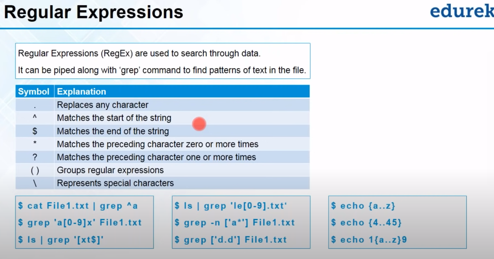

# Linux World

## Linux High level understanding

### Linux Introduction

---
### Linux Distributions

---
### Linux Features

---
### Basic Commands PWD and clear


---
### ls commands


---
### cd commands


---
### cat commands


* Cat Command use 1
```ssh
jdublnx@JDUBUNTO:~$ cd Documents/
jdublnx@JDUBUNTO:~/Documents$ ls
file1.txt
jdublnx@JDUBUNTO:~/Documents$ cat file1.txt 
total 100
drwxr-xr-x 16 jdublnx jdublnx 4096  4月 22 11:15 .
drwxr-xr-x  3 root    root    4096  4月 21 14:04 ..
drwxr-xr-x 13 jdublnx jdublnx 4096  4月 21 16:11 .cache
drwx------ 11 jdublnx jdublnx 4096  4月 21 14:25 .config
drwxr-xr-x  2 jdublnx jdublnx 4096  4月 22 09:25 Desktop
drwxr-xr-x  2 jdublnx jdublnx 4096  4月 22 11:25 Documents
drwxr-xr-x  2 jdublnx jdublnx 4096  4月 21 14:13 Downloads
drwx------  3 jdublnx jdublnx 4096  4月 21 14:14 .gnupg
drwxr-xr-x  3 jdublnx jdublnx 4096  4月 21 14:13 .local
drwx------  4 jdublnx jdublnx 4096  4月 21 14:19 .mozilla
drwxr-xr-x  2 jdublnx jdublnx 4096  4月 21 14:13 Music
drwxr-xr-x  2 jdublnx jdublnx 4096  4月 21 14:13 Pictures
drwxr-xr-x  2 jdublnx jdublnx 4096  4月 21 14:13 Public
drwx------  2 jdublnx jdublnx 4096  4月 21 14:14 .ssh
drwxr-xr-x  2 jdublnx jdublnx 4096  4月 21 14:13 Templates
drwxr-xr-x  2 jdublnx jdublnx 4096  4月 21 14:13 Videos
-rw-r--r--  1 jdublnx jdublnx 3771  4月 21 14:04 .bashrc
-rw-rw-rw-  1 jdublnx jdublnx 1929  4月 22 11:15 Install_CentOS_in_VM.md
-rw-r--r--  1 jdublnx jdublnx  807  4月 21 14:04 .profile
-rw-------  1 jdublnx jdublnx  378  4月 22 09:47 .bash_history
-rw-r--r--  1 jdublnx jdublnx  220  4月 21 14:04 .bash_logout
-rw-r-----  1 jdublnx jdublnx    5  4月 22 09:12 .vboxclient-clipboard.pid
-rw-r-----  1 jdublnx jdublnx    5  4月 22 09:12 .vboxclient-display-svga-x11.pid
-rw-r-----  1 jdublnx jdublnx    5  4月 22 09:12 .vboxclient-draganddrop.pid
-rw-r-----  1 jdublnx jdublnx    5  4月 22 09:12 .vboxclient-seamless.pid
-rw-r--r--  1 jdublnx jdublnx    0  4月 21 14:17 .sudo_as_admin_successful
jdublnx@JDUBUNTO:~/Documents$ cat > file2.txt
hi my name is jd
welcome to linux world 
jdublnx@JDUBUNTO:~/Documents$ cat file2.txt 
hi my name is jd
welcome to linux world
jdublnx@JDUBUNTO:~/Documents$ cat file1.txt 
total 100
drwxr-xr-x 16 jdublnx jdublnx 4096  4月 22 11:15 .
drwxr-xr-x  3 root    root    4096  4月 21 14:04 ..
drwxr-xr-x 13 jdublnx jdublnx 4096  4月 21 16:11 .cache
drwx------ 11 jdublnx jdublnx 4096  4月 21 14:25 .config
drwxr-xr-x  2 jdublnx jdublnx 4096  4月 22 09:25 Desktop
drwxr-xr-x  2 jdublnx jdublnx 4096  4月 22 11:25 Documents
drwxr-xr-x  2 jdublnx jdublnx 4096  4月 21 14:13 Downloads
drwx------  3 jdublnx jdublnx 4096  4月 21 14:14 .gnupg
drwxr-xr-x  3 jdublnx jdublnx 4096  4月 21 14:13 .local
drwx------  4 jdublnx jdublnx 4096  4月 21 14:19 .mozilla
drwxr-xr-x  2 jdublnx jdublnx 4096  4月 21 14:13 Music
drwxr-xr-x  2 jdublnx jdublnx 4096  4月 21 14:13 Pictures
drwxr-xr-x  2 jdublnx jdublnx 4096  4月 21 14:13 Public
drwx------  2 jdublnx jdublnx 4096  4月 21 14:14 .ssh
drwxr-xr-x  2 jdublnx jdublnx 4096  4月 21 14:13 Templates
drwxr-xr-x  2 jdublnx jdublnx 4096  4月 21 14:13 Videos
-rw-r--r--  1 jdublnx jdublnx 3771  4月 21 14:04 .bashrc
-rw-rw-rw-  1 jdublnx jdublnx 1929  4月 22 11:15 Install_CentOS_in_VM.md
-rw-r--r--  1 jdublnx jdublnx  807  4月 21 14:04 .profile
-rw-------  1 jdublnx jdublnx  378  4月 22 09:47 .bash_history
-rw-r--r--  1 jdublnx jdublnx  220  4月 21 14:04 .bash_logout
-rw-r-----  1 jdublnx jdublnx    5  4月 22 09:12 .vboxclient-clipboard.pid
-rw-r-----  1 jdublnx jdublnx    5  4月 22 09:12 .vboxclient-display-svga-x11.pid
-rw-r-----  1 jdublnx jdublnx    5  4月 22 09:12 .vboxclient-draganddrop.pid
-rw-r-----  1 jdublnx jdublnx    5  4月 22 09:12 .vboxclient-seamless.pid
-rw-r--r--  1 jdublnx jdublnx    0  4月 21 14:17 .sudo_as_admin_successful
jdublnx@JDUBUNTO:~/Documents$ cat file1.txt file2.txt 
total 100
drwxr-xr-x 16 jdublnx jdublnx 4096  4月 22 11:15 .
drwxr-xr-x  3 root    root    4096  4月 21 14:04 ..
drwxr-xr-x 13 jdublnx jdublnx 4096  4月 21 16:11 .cache
drwx------ 11 jdublnx jdublnx 4096  4月 21 14:25 .config
drwxr-xr-x  2 jdublnx jdublnx 4096  4月 22 09:25 Desktop
drwxr-xr-x  2 jdublnx jdublnx 4096  4月 22 11:25 Documents
drwxr-xr-x  2 jdublnx jdublnx 4096  4月 21 14:13 Downloads
drwx------  3 jdublnx jdublnx 4096  4月 21 14:14 .gnupg
drwxr-xr-x  3 jdublnx jdublnx 4096  4月 21 14:13 .local
drwx------  4 jdublnx jdublnx 4096  4月 21 14:19 .mozilla
drwxr-xr-x  2 jdublnx jdublnx 4096  4月 21 14:13 Music
drwxr-xr-x  2 jdublnx jdublnx 4096  4月 21 14:13 Pictures
drwxr-xr-x  2 jdublnx jdublnx 4096  4月 21 14:13 Public
drwx------  2 jdublnx jdublnx 4096  4月 21 14:14 .ssh
drwxr-xr-x  2 jdublnx jdublnx 4096  4月 21 14:13 Templates
drwxr-xr-x  2 jdublnx jdublnx 4096  4月 21 14:13 Videos
-rw-r--r--  1 jdublnx jdublnx 3771  4月 21 14:04 .bashrc
-rw-rw-rw-  1 jdublnx jdublnx 1929  4月 22 11:15 Install_CentOS_in_VM.md
-rw-r--r--  1 jdublnx jdublnx  807  4月 21 14:04 .profile
-rw-------  1 jdublnx jdublnx  378  4月 22 09:47 .bash_history
-rw-r--r--  1 jdublnx jdublnx  220  4月 21 14:04 .bash_logout
-rw-r-----  1 jdublnx jdublnx    5  4月 22 09:12 .vboxclient-clipboard.pid
-rw-r-----  1 jdublnx jdublnx    5  4月 22 09:12 .vboxclient-display-svga-x11.pid
-rw-r-----  1 jdublnx jdublnx    5  4月 22 09:12 .vboxclient-draganddrop.pid
-rw-r-----  1 jdublnx jdublnx    5  4月 22 09:12 .vboxclient-seamless.pid
-rw-r--r--  1 jdublnx jdublnx    0  4月 21 14:17 .sudo_as_admin_successful
hi my name is jd
welcome to linux world
jdublnx@JDUBUNTO:~/Documents$ cat file1.txt >> file2.txt 
jdublnx@JDUBUNTO:~/Documents$ cat file2.txt 
hi my name is jd
welcome to linux world
total 100
drwxr-xr-x 16 jdublnx jdublnx 4096  4月 22 11:15 .
drwxr-xr-x  3 root    root    4096  4月 21 14:04 ..
drwxr-xr-x 13 jdublnx jdublnx 4096  4月 21 16:11 .cache
drwx------ 11 jdublnx jdublnx 4096  4月 21 14:25 .config
drwxr-xr-x  2 jdublnx jdublnx 4096  4月 22 09:25 Desktop
drwxr-xr-x  2 jdublnx jdublnx 4096  4月 22 11:25 Documents
drwxr-xr-x  2 jdublnx jdublnx 4096  4月 21 14:13 Downloads
drwx------  3 jdublnx jdublnx 4096  4月 21 14:14 .gnupg
drwxr-xr-x  3 jdublnx jdublnx 4096  4月 21 14:13 .local
drwx------  4 jdublnx jdublnx 4096  4月 21 14:19 .mozilla
drwxr-xr-x  2 jdublnx jdublnx 4096  4月 21 14:13 Music
drwxr-xr-x  2 jdublnx jdublnx 4096  4月 21 14:13 Pictures
drwxr-xr-x  2 jdublnx jdublnx 4096  4月 21 14:13 Public
drwx------  2 jdublnx jdublnx 4096  4月 21 14:14 .ssh
drwxr-xr-x  2 jdublnx jdublnx 4096  4月 21 14:13 Templates
drwxr-xr-x  2 jdublnx jdublnx 4096  4月 21 14:13 Videos
-rw-r--r--  1 jdublnx jdublnx 3771  4月 21 14:04 .bashrc
-rw-rw-rw-  1 jdublnx jdublnx 1929  4月 22 11:15 Install_CentOS_in_VM.md
-rw-r--r--  1 jdublnx jdublnx  807  4月 21 14:04 .profile
-rw-------  1 jdublnx jdublnx  378  4月 22 09:47 .bash_history
-rw-r--r--  1 jdublnx jdublnx  220  4月 21 14:04 .bash_logout
-rw-r-----  1 jdublnx jdublnx    5  4月 22 09:12 .vboxclient-clipboard.pid
-rw-r-----  1 jdublnx jdublnx    5  4月 22 09:12 .vboxclient-display-svga-x11.pid
-rw-r-----  1 jdublnx jdublnx    5  4月 22 09:12 .vboxclient-draganddrop.pid
-rw-r-----  1 jdublnx jdublnx    5  4月 22 09:12 .vboxclient-seamless.pid
-rw-r--r--  1 jdublnx jdublnx    0  4月 21 14:17 .sudo_as_admin_successful
jdublnx@JDUBUNTO:~/Documents$ ^C

```

* Cat Command use 2
```linux
jdublnx@JDUBUNTO:~/Documents$ cat -n file2.txt 
     1	hi my name is jd
     2	welcome to linux world
     3	total 100
     4	drwxr-xr-x 16 jdublnx jdublnx 4096  4月 22 11:15 .
     5	drwxr-xr-x  3 root    root    4096  4月 21 14:04 ..
     6	drwxr-xr-x 13 jdublnx jdublnx 4096  4月 21 16:11 .cache
     7	drwx------ 11 jdublnx jdublnx 4096  4月 21 14:25 .config
     8	drwxr-xr-x  2 jdublnx jdublnx 4096  4月 22 09:25 Desktop
     9	drwxr-xr-x  2 jdublnx jdublnx 4096  4月 22 11:25 Documents
    10	drwxr-xr-x  2 jdublnx jdublnx 4096  4月 21 14:13 Downloads
    11	drwx------  3 jdublnx jdublnx 4096  4月 21 14:14 .gnupg
    12	drwxr-xr-x  3 jdublnx jdublnx 4096  4月 21 14:13 .local
    13	drwx------  4 jdublnx jdublnx 4096  4月 21 14:19 .mozilla
    14	drwxr-xr-x  2 jdublnx jdublnx 4096  4月 21 14:13 Music
    15	drwxr-xr-x  2 jdublnx jdublnx 4096  4月 21 14:13 Pictures
    16	drwxr-xr-x  2 jdublnx jdublnx 4096  4月 21 14:13 Public
    17	drwx------  2 jdublnx jdublnx 4096  4月 21 14:14 .ssh
    18	drwxr-xr-x  2 jdublnx jdublnx 4096  4月 21 14:13 Templates
    19	drwxr-xr-x  2 jdublnx jdublnx 4096  4月 21 14:13 Videos
    20	-rw-r--r--  1 jdublnx jdublnx 3771  4月 21 14:04 .bashrc
    21	-rw-rw-rw-  1 jdublnx jdublnx 1929  4月 22 11:15 Install_CentOS_in_VM.md
    22	-rw-r--r--  1 jdublnx jdublnx  807  4月 21 14:04 .profile
    23	-rw-------  1 jdublnx jdublnx  378  4月 22 09:47 .bash_history
    24	-rw-r--r--  1 jdublnx jdublnx  220  4月 21 14:04 .bash_logout
    25	-rw-r-----  1 jdublnx jdublnx    5  4月 22 09:12 .vboxclient-clipboard.pid
    26	-rw-r-----  1 jdublnx jdublnx    5  4月 22 09:12 .vboxclient-display-svga-x11.pid
    27	-rw-r-----  1 jdublnx jdublnx    5  4月 22 09:12 .vboxclient-draganddrop.pid
    28	-rw-r-----  1 jdublnx jdublnx    5  4月 22 09:12 .vboxclient-seamless.pid
    29	-rw-r--r--  1 jdublnx jdublnx    0  4月 21 14:17 .sudo_as_admin_successful
jdublnx@JDUBUNTO:~/Documents$ cat -b file2.txt 
     1	hi my name is jd
     2	welcome to linux world
     3	total 100
     4	drwxr-xr-x 16 jdublnx jdublnx 4096  4月 22 11:15 .
     5	drwxr-xr-x  3 root    root    4096  4月 21 14:04 ..
     6	drwxr-xr-x 13 jdublnx jdublnx 4096  4月 21 16:11 .cache
     7	drwx------ 11 jdublnx jdublnx 4096  4月 21 14:25 .config
     8	drwxr-xr-x  2 jdublnx jdublnx 4096  4月 22 09:25 Desktop
     9	drwxr-xr-x  2 jdublnx jdublnx 4096  4月 22 11:25 Documents
    10	drwxr-xr-x  2 jdublnx jdublnx 4096  4月 21 14:13 Downloads
    11	drwx------  3 jdublnx jdublnx 4096  4月 21 14:14 .gnupg
    12	drwxr-xr-x  3 jdublnx jdublnx 4096  4月 21 14:13 .local
    13	drwx------  4 jdublnx jdublnx 4096  4月 21 14:19 .mozilla
    14	drwxr-xr-x  2 jdublnx jdublnx 4096  4月 21 14:13 Music
    15	drwxr-xr-x  2 jdublnx jdublnx 4096  4月 21 14:13 Pictures
    16	drwxr-xr-x  2 jdublnx jdublnx 4096  4月 21 14:13 Public
    17	drwx------  2 jdublnx jdublnx 4096  4月 21 14:14 .ssh
    18	drwxr-xr-x  2 jdublnx jdublnx 4096  4月 21 14:13 Templates
    19	drwxr-xr-x  2 jdublnx jdublnx 4096  4月 21 14:13 Videos
    20	-rw-r--r--  1 jdublnx jdublnx 3771  4月 21 14:04 .bashrc
    21	-rw-rw-rw-  1 jdublnx jdublnx 1929  4月 22 11:15 Install_CentOS_in_VM.md
    22	-rw-r--r--  1 jdublnx jdublnx  807  4月 21 14:04 .profile
    23	-rw-------  1 jdublnx jdublnx  378  4月 22 09:47 .bash_history
    24	-rw-r--r--  1 jdublnx jdublnx  220  4月 21 14:04 .bash_logout
    25	-rw-r-----  1 jdublnx jdublnx    5  4月 22 09:12 .vboxclient-clipboard.pid
    26	-rw-r-----  1 jdublnx jdublnx    5  4月 22 09:12 .vboxclient-display-svga-x11.pid
    27	-rw-r-----  1 jdublnx jdublnx    5  4月 22 09:12 .vboxclient-draganddrop.pid
    28	-rw-r-----  1 jdublnx jdublnx    5  4月 22 09:12 .vboxclient-seamless.pid
    29	-rw-r--r--  1 jdublnx jdublnx    0  4月 21 14:17 .sudo_as_admin_successful
jdublnx@JDUBUNTO:~/Documents$ vi file2.txt 
jdublnx@JDUBUNTO:~/Documents$ 
```

---
### grep commands


* Grep Command Usage

```linux
jdublnx@JDUBUNTO:~/Documents$ cat Automobiles.txt 
Car
Mortorbikes
Train
Maruti
Ferrari
Lamborgini
Yamaha
Aprillia
Tata Motor
Honda
Suzuki
BMW
Audi
Volkswagen
jdublnx@JDUBUNTO:~/Documents$ grep am Automobiles.txt 
Lamborgini
Yamaha
jdublnx@JDUBUNTO:~/Documents$ grep -i am Automobiles.txt 
Lamborgini
Yamaha
jdublnx@JDUBUNTO:~/Documents$ grep -i am Automobiles.txt 
Lamborgini
Yamaha
Amber
jdublnx@JDUBUNTO:~/Documents$ grep am Automobiles.txt 
Lamborgini
Yamaha
jdublnx@JDUBUNTO:~/Documents$ grep -i am Automobiles.txt 
Lamborgini
Yamaha
Amber
jdublnx@JDUBUNTO:~/Documents$ grep -n am Automobiles.txt 
6:Lamborgini
7:Yamaha
jdublnx@JDUBUNTO:~/Documents$ grep -v am Automobiles.txt 
Car
Mortorbikes
Train
Maruti
Ferrari
Aprillia
Tata Motor
Honda
Suzuki
BMW
Audi
Volkswagen
Amber
jdublnx@JDUBUNTO:~/Documents$ grep -iv am Automobiles.txt 
Car
Mortorbikes
Train
Maruti
Ferrari
Aprillia
Tata Motor
Honda
Suzuki
BMW
Audi
Volkswagen
jdublnx@JDUBUNTO:~/Documents$ grep -c am Automobiles.txt 
2
jdublnx@JDUBUNTO:~/Documents$ grep -ic am Automobiles.txt 
3
jdublnx@JDUBUNTO:~/Documents$ 

```

---

### sort commands


<html>
<pre><font color="#4E9A06"><b>jdublnx@JDUBUNTO</b></font>:<font color="#3465A4"><b>~/Documents</b></font>$ cat Automobiles.txt 
Car
Mortorbikes
Train
Maruti
Ferrari
Lamborgini
Yamaha
Aprillia
Tata Motor
Honda
Suzuki
BMW
Audi
Volkswagen
Amber
<font color="#4E9A06"><b>jdublnx@JDUBUNTO</b></font>:<font color="#3465A4"><b>~/Documents</b></font>$ sort Automobiles.txt 
Amber
Aprillia
Audi
BMW
Car
Ferrari
Honda
Lamborgini
Maruti
Mortorbikes
Suzuki
Tata Motor
Train
Volkswagen
Yamaha
<font color="#4E9A06"><b>jdublnx@JDUBUNTO</b></font>:<font color="#3465A4"><b>~/Documents</b></font>$ sort Automobiles.txt file2.txt 
Amber
Aprillia
Audi
BMW
Car
drwx------ 11 jdublnx jdublnx 4096  4月 21 14:25 .config
drwx------  2 jdublnx jdublnx 4096  4月 21 14:14 .ssh
drwx------  3 jdublnx jdublnx 4096  4月 21 14:14 .gnupg
drwx------  4 jdublnx jdublnx 4096  4月 21 14:19 .mozilla
drwxr-xr-x 13 jdublnx jdublnx 4096  4月 21 16:11 .cache
drwxr-xr-x 16 jdublnx jdublnx 4096  4月 22 11:15 .
drwxr-xr-x  2 jdublnx jdublnx 4096  4月 21 14:13 Downloads
drwxr-xr-x  2 jdublnx jdublnx 4096  4月 21 14:13 Music
drwxr-xr-x  2 jdublnx jdublnx 4096  4月 21 14:13 Pictures
drwxr-xr-x  2 jdublnx jdublnx 4096  4月 21 14:13 Public
drwxr-xr-x  2 jdublnx jdublnx 4096  4月 21 14:13 Templates
drwxr-xr-x  2 jdublnx jdublnx 4096  4月 21 14:13 Videos
drwxr-xr-x  2 jdublnx jdublnx 4096  4月 22 09:25 Desktop
drwxr-xr-x  2 jdublnx jdublnx 4096  4月 22 11:25 Documents
drwxr-xr-x  3 jdublnx jdublnx 4096  4月 21 14:13 .local
drwxr-xr-x  3 root    root    4096  4月 21 14:04 ..
Ferrari
Hi my name is jd
Honda
Lamborgini
Maruti
Mortorbikes
-rw-------  1 jdublnx jdublnx  378  4月 22 09:47 .bash_history
-rw-r-----  1 jdublnx jdublnx    5  4月 22 09:12 .vboxclient-clipboard.pid
-rw-r-----  1 jdublnx jdublnx    5  4月 22 09:12 .vboxclient-display-svga-x11.pid
-rw-r-----  1 jdublnx jdublnx    5  4月 22 09:12 .vboxclient-draganddrop.pid
-rw-r-----  1 jdublnx jdublnx    5  4月 22 09:12 .vboxclient-seamless.pid
-rw-r--r--  1 jdublnx jdublnx    0  4月 21 14:17 .sudo_as_admin_successful
-rw-r--r--  1 jdublnx jdublnx  220  4月 21 14:04 .bash_logout
-rw-r--r--  1 jdublnx jdublnx 3771  4月 21 14:04 .bashrc
-rw-r--r--  1 jdublnx jdublnx  807  4月 21 14:04 .profile
-rw-rw-rw-  1 jdublnx jdublnx 1929  4月 22 11:15 Install_CentOS_in_VM.md
Suzuki
Tata Motor
Total 100
Train
Volkswagen
welcome to linux world
Yamaha
<font color="#4E9A06"><b>jdublnx@JDUBUNTO</b></font>:<font color="#3465A4"><b>~/Documents</b></font>$ sort -r Automobiles.txt 
Yamaha
Volkswagen
Train
Tata Motor
Suzuki
Mortorbikes
Maruti
Lamborgini
Honda
Ferrari
Car
BMW
Audi
Aprillia
Amber
<font color="#4E9A06"><b>jdublnx@JDUBUNTO</b></font>:<font color="#3465A4"><b>~/Documents</b></font>$ sort -f Automobiles.txt 
Amber
Aprillia
Audi
BMW
Car
Ferrari
Honda
Lamborgini
Maruti
Mortorbikes
Suzuki
Tata Motor
Train
Volkswagen
Yamaha
<font color="#4E9A06"><b>jdublnx@JDUBUNTO</b></font>:<font color="#3465A4"><b>~/Documents</b></font>$ sort -n Automobiles.txt 
Amber
Aprillia
Audi
BMW
Car
Ferrari
Honda
Lamborgini
Maruti
Mortorbikes
Suzuki
Tata Motor
Train
Volkswagen
Yamaha
<font color="#4E9A06"><b>jdublnx@JDUBUNTO</b></font>:<font color="#3465A4"><b>~/Documents</b></font>$ sort -n Automobiles.txt 
</pre>
</html>

---

### pipe commands


<html>
<body>
<pre>
<font color="#4E9A06"><b>jdublnx@JDUBUNTO</b></font>:<font color="#3465A4"><b>~/Documents</b></font>$ grep am Automobiles.txt | sort
Lamborgini
Yamaha
<font color="#4E9A06"><b>jdublnx@JDUBUNTO</b></font>:<font color="#3465A4"><b>~/Documents</b></font>$ grep am Automobiles.txt | sort -r
Yamaha
Lamborgini
<font color="#4E9A06"><b>jdublnx@JDUBUNTO</b></font>:<font color="#3465A4"><b>~/Documents</b></font>$ 

</pre>
</body>
</html>

---

### cp commands


<html>
<body>
<pre>
<font color="#4E9A06"><b>jdublnx@JDUBUNTO</b></font>:<font color="#3465A4"><b>~/Documents</b></font>$ ls
Automobiles.txt  file1.txt  file2.txt
<font color="#4E9A06"><b>jdublnx@JDUBUNTO</b></font>:<font color="#3465A4"><b>~/Documents</b></font>$ cp Automobiles.txt /home/jdublnx/Desktop/
<font color="#4E9A06"><b>jdublnx@JDUBUNTO</b></font>:<font color="#3465A4"><b>~/Documents</b></font>$ cd 
<font color="#4E9A06"><b>jdublnx@JDUBUNTO</b></font>:<font color="#3465A4"><b>~</b></font>$ ls
<font color="#3465A4"><b>Desktop</b></font>  <font color="#3465A4"><b>Documents</b></font>  <font color="#3465A4"><b>Downloads</b></font>  file1.txt  Install_CentOS_in_VM.md  <font color="#3465A4"><b>Music</b></font>  <font color="#3465A4"><b>Pictures</b></font>  <font color="#3465A4"><b>Public</b></font>  <font color="#3465A4"><b>Templates</b></font>  <font color="#3465A4"><b>Videos</b></font>
<font color="#4E9A06"><b>jdublnx@JDUBUNTO</b></font>:<font color="#3465A4"><b>~</b></font>$ cd Desktop/
<font color="#4E9A06"><b>jdublnx@JDUBUNTO</b></font>:<font color="#3465A4"><b>~/Desktop</b></font>$ ls
Automobiles.txt  <font color="#3465A4"><b>LMS</b></font>  README.md
<font color="#4E9A06"><b>jdublnx@JDUBUNTO</b></font>:<font color="#3465A4"><b>~/Desktop</b></font>$ cp LMS /home/jdublnx/Documents/
cp: -r not specified; omitting directory &apos;LMS&apos;
<font color="#4E9A06"><b>jdublnx@JDUBUNTO</b></font>:<font color="#3465A4"><b>~/Desktop</b></font>$ cp -R  LMS /home/jdublnx/Documents/
<font color="#4E9A06"><b>jdublnx@JDUBUNTO</b></font>:<font color="#3465A4"><b>~/Desktop</b></font>$ cp -Rv  LMS /home/jdublnx/Documents/
&apos;LMS&apos; -&gt; &apos;/home/jdublnx/Documents/LMS&apos;
<font color="#4E9A06"><b>jdublnx@JDUBUNTO</b></font>:<font color="#3465A4"><b>~/Desktop</b></font>$ cd ..
<font color="#4E9A06"><b>jdublnx@JDUBUNTO</b></font>:<font color="#3465A4"><b>~</b></font>$ cd Documents/
<font color="#4E9A06"><b>jdublnx@JDUBUNTO</b></font>:<font color="#3465A4"><b>~/Documents</b></font>$ cp Automobiles.txt /home/jdublnx/Desktop/
<font color="#4E9A06"><b>jdublnx@JDUBUNTO</b></font>:<font color="#3465A4"><b>~/Documents</b></font>$ cp -i  Automobiles.txt /home/jdublnx/Desktop/
cp: overwrite &apos;/home/jdublnx/Desktop/Automobiles.txt&apos;? y
<font color="#4E9A06"><b>jdublnx@JDUBUNTO</b></font>:<font color="#3465A4"><b>~/Documents</b></font>$ cp -i  Automobiles.txt /home/jdublnx/Desktop/
cp: overwrite &apos;/home/jdublnx/Desktop/Automobiles.txt&apos;? n
<font color="#4E9A06"><b>jdublnx@JDUBUNTO</b></font>:<font color="#3465A4"><b>~/Documents</b></font>$ cp -n  Automobiles.txt /home/jdublnx/Desktop/
<font color="#4E9A06"><b>jdublnx@JDUBUNTO</b></font>:<font color="#3465A4"><b>~/Documents</b></font>$ 
</pre>
</body>
</html>

---
### mv commands


<html>
<body>
<pre><font color="#4E9A06"><b>jdublnx@JDUBUNTO</b></font>:<font color="#3465A4"><b>~</b></font>$ ls
<font color="#3465A4"><b>Desktop</b></font>  <font color="#3465A4"><b>Documents</b></font>  <font color="#3465A4"><b>Downloads</b></font>  file1.txt  Install_CentOS_in_VM.md  <font color="#3465A4"><b>Music</b></font>  <font color="#3465A4"><b>Pictures</b></font>  <font color="#3465A4"><b>Public</b></font>  <font color="#3465A4"><b>Templates</b></font>  <font color="#3465A4"><b>Videos</b></font>
<font color="#4E9A06"><b>jdublnx@JDUBUNTO</b></font>:<font color="#3465A4"><b>~</b></font>$ cd Desktop/
<font color="#4E9A06"><b>jdublnx@JDUBUNTO</b></font>:<font color="#3465A4"><b>~/Desktop</b></font>$ ls
Automobiles.txt  <font color="#3465A4"><b>LMS</b></font>  README.md
<font color="#4E9A06"><b>jdublnx@JDUBUNTO</b></font>:<font color="#3465A4"><b>~/Desktop</b></font>$ mv README.md LMS/
<font color="#4E9A06"><b>jdublnx@JDUBUNTO</b></font>:<font color="#3465A4"><b>~/Desktop</b></font>$ ls
Automobiles.txt  <font color="#3465A4"><b>LMS</b></font>
<font color="#4E9A06"><b>jdublnx@JDUBUNTO</b></font>:<font color="#3465A4"><b>~/Desktop</b></font>$ cd LMS/
<font color="#4E9A06"><b>jdublnx@JDUBUNTO</b></font>:<font color="#3465A4"><b>~/Desktop/LMS</b></font>$ ls
README.md
<font color="#4E9A06"><b>jdublnx@JDUBUNTO</b></font>:<font color="#3465A4"><b>~/Desktop/LMS</b></font>$ 

</pre>


</body>
</html>

### mv/cp commands with all txt files


<html>
<body>

<pre><font color="#4E9A06"><b>jdublnx@JDUBUNTO</b></font>:<font color="#3465A4"><b>~</b></font>$ ls
<font color="#3465A4"><b>Desktop</b></font>  <font color="#3465A4"><b>Documents</b></font>  <font color="#3465A4"><b>Downloads</b></font>  file1.txt  Install_CentOS_in_VM.md  <font color="#3465A4"><b>Music</b></font>  <font color="#3465A4"><b>Pictures</b></font>  <font color="#3465A4"><b>Public</b></font>  <font color="#3465A4"><b>Templates</b></font>  <font color="#3465A4"><b>Videos</b></font>
<font color="#4E9A06"><b>jdublnx@JDUBUNTO</b></font>:<font color="#3465A4"><b>~</b></font>$ cd Music/
<font color="#4E9A06"><b>jdublnx@JDUBUNTO</b></font>:<font color="#3465A4"><b>~/Music</b></font>$ ls
<font color="#4E9A06"><b>jdublnx@JDUBUNTO</b></font>:<font color="#3465A4"><b>~/Music</b></font>$ cd ..
<font color="#4E9A06"><b>jdublnx@JDUBUNTO</b></font>:<font color="#3465A4"><b>~</b></font>$ cd Documents/
<font color="#4E9A06"><b>jdublnx@JDUBUNTO</b></font>:<font color="#3465A4"><b>~/Documents</b></font>$ ls
Automobiles.txt  file1.txt  file2.txt  <font color="#3465A4"><b>LMS</b></font>
<font color="#4E9A06"><b>jdublnx@JDUBUNTO</b></font>:<font color="#3465A4"><b>~/Documents</b></font>$ cp *.txt /home/jdublnx/Music/
<font color="#4E9A06"><b>jdublnx@JDUBUNTO</b></font>:<font color="#3465A4"><b>~/Documents</b></font>$ cd ..
<font color="#4E9A06"><b>jdublnx@JDUBUNTO</b></font>:<font color="#3465A4"><b>~</b></font>$ cd Music/
<font color="#4E9A06"><b>jdublnx@JDUBUNTO</b></font>:<font color="#3465A4"><b>~/Music</b></font>$ ls
Automobiles.txt  file1.txt  file2.txt
<font color="#4E9A06"><b>jdublnx@JDUBUNTO</b></font>:<font color="#3465A4"><b>~/Music</b></font>$ mv  *.txt /home/jdublnx/Pictures/
<font color="#4E9A06"><b>jdublnx@JDUBUNTO</b></font>:<font color="#3465A4"><b>~/Music</b></font>$ ls
<font color="#4E9A06"><b>jdublnx@JDUBUNTO</b></font>:<font color="#3465A4"><b>~/Music</b></font>$ cd ..
<font color="#4E9A06"><b>jdublnx@JDUBUNTO</b></font>:<font color="#3465A4"><b>~</b></font>$ cd Pictures/
<font color="#4E9A06"><b>jdublnx@JDUBUNTO</b></font>:<font color="#3465A4"><b>~/Pictures</b></font>$ ls
Automobiles.txt  file1.txt  file2.txt
<font color="#4E9A06"><b>jdublnx@JDUBUNTO</b></font>:<font color="#3465A4"><b>~/Pictures</b></font>$ ^C
<font color="#4E9A06"><b>jdublnx@JDUBUNTO</b></font>:<font color="#3465A4"><b>~/Pictures</b></font>$ 

</pre>
</body>
</html>


---
### mkdir commands


<html>
<body>
<pre><font color="#4E9A06"><b>jdublnx@JDUBUNTO</b></font>:<font color="#3465A4"><b>~/Documents</b></font>$ ls
Automobiles.txt  file1.txt  file2.txt  <font color="#3465A4"><b>LMS</b></font>
<font color="#4E9A06"><b>jdublnx@JDUBUNTO</b></font>:<font color="#3465A4"><b>~/Documents</b></font>$ mkdir Folder1
<font color="#4E9A06"><b>jdublnx@JDUBUNTO</b></font>:<font color="#3465A4"><b>~/Documents</b></font>$ ls
Automobiles.txt  file1.txt  file2.txt  <font color="#3465A4"><b>Folder1</b></font>  <font color="#3465A4"><b>LMS</b></font>
<font color="#4E9A06"><b>jdublnx@JDUBUNTO</b></font>:<font color="#3465A4"><b>~/Documents</b></font>$ cd Folder1/
<font color="#4E9A06"><b>jdublnx@JDUBUNTO</b></font>:<font color="#3465A4"><b>~/Documents/Folder1</b></font>$ ls
<font color="#4E9A06"><b>jdublnx@JDUBUNTO</b></font>:<font color="#3465A4"><b>~/Documents/Folder1</b></font>$ mkdir Folder2/Folder3/Folder4
mkdir: cannot create directory ‘Folder2/Folder3/Folder4’: No such file or directory
<font color="#4E9A06"><b>jdublnx@JDUBUNTO</b></font>:<font color="#3465A4"><b>~/Documents/Folder1</b></font>$ mkdir -p Folder2/Folder3/Folder4
<font color="#4E9A06"><b>jdublnx@JDUBUNTO</b></font>:<font color="#3465A4"><b>~/Documents/Folder1</b></font>$ mkdir {Folder2,Folder3,Folder4}
mkdir: cannot create directory ‘Folder2’: File exists
<font color="#4E9A06"><b>jdublnx@JDUBUNTO</b></font>:<font color="#3465A4"><b>~/Documents/Folder1</b></font>$ mkdir -p f2{Folder2,Folder3,Folder4}
<font color="#4E9A06"><b>jdublnx@JDUBUNTO</b></font>:<font color="#3465A4"><b>~/Documents/Folder1</b></font>$ ls
<font color="#3465A4"><b>f2Folder2</b></font>  <font color="#3465A4"><b>f2Folder3</b></font>  <font color="#3465A4"><b>f2Folder4</b></font>  <font color="#3465A4"><b>Folder2</b></font>  <font color="#3465A4"><b>Folder3</b></font>  <font color="#3465A4"><b>Folder4</b></font>
<font color="#4E9A06"><b>jdublnx@JDUBUNTO</b></font>:<font color="#3465A4"><b>~/Documents/Folder1</b></font>$ ls
<font color="#3465A4"><b>Folder2</b></font>  <font color="#3465A4"><b>Folder3</b></font>  <font color="#3465A4"><b>Folder4</b></font>
<font color="#4E9A06"><b>jdublnx@JDUBUNTO</b></font>:<font color="#3465A4"><b>~/Documents/Folder1</b></font>$ mkdir -p f2/{Folder2,Folder3,Folder4}
<font color="#4E9A06"><b>jdublnx@JDUBUNTO</b></font>:<font color="#3465A4"><b>~/Documents/Folder1</b></font>$ ls
<font color="#3465A4"><b>f2</b></font>  <font color="#3465A4"><b>Folder2</b></font>  <font color="#3465A4"><b>Folder3</b></font>  <font color="#3465A4"><b>Folder4</b></font>
<font color="#4E9A06"><b>jdublnx@JDUBUNTO</b></font>:<font color="#3465A4"><b>~/Documents/Folder1</b></font>$ 

</pre>
</body>
</html>

---
### rm & rmdir commands


<html>
<body>
<pre><font color="#4E9A06"><b>jdublnx@JDUBUNTO</b></font>:<font color="#3465A4"><b>~/Documents/Folder1/Folder2/Folder3</b></font>$ ls
<font color="#3465A4"><b>Folder4</b></font>
<font color="#4E9A06"><b>jdublnx@JDUBUNTO</b></font>:<font color="#3465A4"><b>~/Documents/Folder1/Folder2/Folder3</b></font>$ rm Folder4/
rm: cannot remove &apos;Folder4/&apos;: Is a directory
<font color="#4E9A06"><b>jdublnx@JDUBUNTO</b></font>:<font color="#3465A4"><b>~/Documents/Folder1/Folder2/Folder3</b></font>$ rmdir Folder4/
<font color="#4E9A06"><b>jdublnx@JDUBUNTO</b></font>:<font color="#3465A4"><b>~/Documents/Folder1/Folder2/Folder3</b></font>$ ls
<font color="#4E9A06"><b>jdublnx@JDUBUNTO</b></font>:<font color="#3465A4"><b>~/Documents/Folder1/Folder2/Folder3</b></font>$ cd ..
<font color="#4E9A06"><b>jdublnx@JDUBUNTO</b></font>:<font color="#3465A4"><b>~/Documents/Folder1/Folder2</b></font>$ ls
<font color="#3465A4"><b>Folder3</b></font>
<font color="#4E9A06"><b>jdublnx@JDUBUNTO</b></font>:<font color="#3465A4"><b>~/Documents/Folder1/Folder2</b></font>$ cd ..
<font color="#4E9A06"><b>jdublnx@JDUBUNTO</b></font>:<font color="#3465A4"><b>~/Documents/Folder1</b></font>$ ls
<font color="#3465A4"><b>f2</b></font>  <font color="#3465A4"><b>Folder2</b></font>  <font color="#3465A4"><b>Folder3</b></font>  <font color="#3465A4"><b>Folder4</b></font>
<font color="#4E9A06"><b>jdublnx@JDUBUNTO</b></font>:<font color="#3465A4"><b>~/Documents/Folder1</b></font>$ rm Folder2/
rm: cannot remove &apos;Folder2/&apos;: Is a directory
<font color="#4E9A06"><b>jdublnx@JDUBUNTO</b></font>:<font color="#3465A4"><b>~/Documents/Folder1</b></font>$ rmdir Folder2/
rmdir: failed to remove &apos;Folder2/&apos;: Directory not empty
<font color="#4E9A06"><b>jdublnx@JDUBUNTO</b></font>:<font color="#3465A4"><b>~/Documents/Folder1</b></font>$ rmdir -p Folder2/Folder3/
<font color="#4E9A06"><b>jdublnx@JDUBUNTO</b></font>:<font color="#3465A4"><b>~/Documents/Folder1</b></font>$ ls
<font color="#3465A4"><b>f2</b></font>  <font color="#3465A4"><b>Folder3</b></font>  <font color="#3465A4"><b>Folder4</b></font>
<font color="#4E9A06"><b>jdublnx@JDUBUNTO</b></font>:<font color="#3465A4"><b>~/Documents/Folder1</b></font>$ cd f2/
<font color="#4E9A06"><b>jdublnx@JDUBUNTO</b></font>:<font color="#3465A4"><b>~/Documents/Folder1/f2</b></font>$ ls
<font color="#3465A4"><b>Folder2</b></font>  <font color="#3465A4"><b>Folder3</b></font>  <font color="#3465A4"><b>Folder4</b></font>
<font color="#4E9A06"><b>jdublnx@JDUBUNTO</b></font>:<font color="#3465A4"><b>~/Documents/Folder1/f2</b></font>$ cd ..
<font color="#4E9A06"><b>jdublnx@JDUBUNTO</b></font>:<font color="#3465A4"><b>~/Documents/Folder1</b></font>$ ls
<font color="#3465A4"><b>f2</b></font>  <font color="#3465A4"><b>Folder3</b></font>  <font color="#3465A4"><b>Folder4</b></font>
<font color="#4E9A06"><b>jdublnx@JDUBUNTO</b></font>:<font color="#3465A4"><b>~/Documents/Folder1</b></font>$ rm -r f2/
<font color="#4E9A06"><b>jdublnx@JDUBUNTO</b></font>:<font color="#3465A4"><b>~/Documents/Folder1</b></font>$ ls
<font color="#3465A4"><b>Folder3</b></font>  <font color="#3465A4"><b>Folder4</b></font>
<font color="#4E9A06"><b>jdublnx@JDUBUNTO</b></font>:<font color="#3465A4"><b>~/Documents/Folder1</b></font>$ 
</pre>
</body>
</html>

---
### Working with user Permissions : 'r','w' & 'x'


<html>
<body>
<pre>drwxr-xr-x 3 jdublnx jdublnx 4096  4月 23 15:19 <font color="#3465A4"><b>Desktop</b></font>
drwxr-xr-x 4 jdublnx jdublnx 4096  4月 23 15:35 <font color="#3465A4"><b>Documents</b></font>
drwxr-xr-x 2 jdublnx jdublnx 4096  4月 21 14:13 <font color="#3465A4"><b>Downloads</b></font>
-rw-rw-r-- 1 jdublnx jdublnx 1691  4月 22 13:24 file1.txt
-rw-rw-rw- 1 jdublnx jdublnx 1929  4月 22 11:15 Install_CentOS_in_VM.md
drwxr-xr-x 2 jdublnx jdublnx 4096  4月 23 15:30 <font color="#3465A4"><b>Music</b></font>
drwxr-xr-x 2 jdublnx jdublnx 4096  4月 23 15:30 <font color="#3465A4"><b>Pictures</b></font>
drwxr-xr-x 2 jdublnx jdublnx 4096  4月 21 14:13 <font color="#3465A4"><b>Public</b></font>
drwxr-xr-x 2 jdublnx jdublnx 4096  4月 21 14:13 <font color="#3465A4"><b>Templates</b></font>
drwxr-xr-x 2 jdublnx jdublnx 4096  4月 21 14:13 <font color="#3465A4"><b>Videos</b></font>
</pre>
</body>
</html>

---

### Working with user Permissions : 'r','w' & 'x' Chmod,Chown,chgrp


<html>
<body>
<pre><font color="#4E9A06"><b>jdublnx@JDUBUNTO</b></font>:<font color="#3465A4"><b>~</b></font>$ ls
<font color="#3465A4"><b>Desktop</b></font>  <font color="#3465A4"><b>Documents</b></font>  <font color="#3465A4"><b>Downloads</b></font>  file1.txt  Install_CentOS_in_VM.md  <font color="#3465A4"><b>Music</b></font>  <font color="#3465A4"><b>Pictures</b></font>  <font color="#3465A4"><b>Public</b></font>  <font color="#3465A4"><b>Templates</b></font>  <font color="#3465A4"><b>Videos</b></font>
<font color="#4E9A06"><b>jdublnx@JDUBUNTO</b></font>:<font color="#3465A4"><b>~</b></font>$ ls -l
total 40
drwxr-xr-x 3 jdublnx jdublnx 4096  4月 23 15:19 <font color="#3465A4"><b>Desktop</b></font>
drwxr-xr-x 4 jdublnx jdublnx 4096  4月 23 15:35 <font color="#3465A4"><b>Documents</b></font>
drwxr-xr-x 2 jdublnx jdublnx 4096  4月 21 14:13 <font color="#3465A4"><b>Downloads</b></font>
-rw-rw-r-- 1 jdublnx jdublnx 1691  4月 22 13:24 file1.txt
-rw-rw-rw- 1 jdublnx jdublnx 1929  4月 22 11:15 Install_CentOS_in_VM.md
drwxr-xr-x 2 jdublnx jdublnx 4096  4月 23 15:30 <font color="#3465A4"><b>Music</b></font>
drwxr-xr-x 2 jdublnx jdublnx 4096  4月 23 15:30 <font color="#3465A4"><b>Pictures</b></font>
drwxr-xr-x 2 jdublnx jdublnx 4096  4月 21 14:13 <font color="#3465A4"><b>Public</b></font>
drwxr-xr-x 2 jdublnx jdublnx 4096  4月 21 14:13 <font color="#3465A4"><b>Templates</b></font>
drwxr-xr-x 2 jdublnx jdublnx 4096  4月 21 14:13 <font color="#3465A4"><b>Videos</b></font>
<font color="#4E9A06"><b>jdublnx@JDUBUNTO</b></font>:<font color="#3465A4"><b>~</b></font>$ chmod g=rw,o-x Pictures/
<font color="#4E9A06"><b>jdublnx@JDUBUNTO</b></font>:<font color="#3465A4"><b>~</b></font>$ ls -l
total 40
drwxr-xr-x 3 jdublnx jdublnx 4096  4月 23 15:19 <font color="#3465A4"><b>Desktop</b></font>
drwxr-xr-x 4 jdublnx jdublnx 4096  4月 23 15:35 <font color="#3465A4"><b>Documents</b></font>
drwxr-xr-x 2 jdublnx jdublnx 4096  4月 21 14:13 <font color="#3465A4"><b>Downloads</b></font>
-rw-rw-r-- 1 jdublnx jdublnx 1691  4月 22 13:24 file1.txt
-rw-rw-rw- 1 jdublnx jdublnx 1929  4月 22 11:15 Install_CentOS_in_VM.md
drwxr-xr-x 2 jdublnx jdublnx 4096  4月 23 15:30 <font color="#3465A4"><b>Music</b></font>
drwxrw-r-- 2 jdublnx jdublnx 4096  4月 23 15:30 <font color="#3465A4"><b>Pictures</b></font>
drwxr-xr-x 2 jdublnx jdublnx 4096  4月 21 14:13 <font color="#3465A4"><b>Public</b></font>
drwxr-xr-x 2 jdublnx jdublnx 4096  4月 21 14:13 <font color="#3465A4"><b>Templates</b></font>
drwxr-xr-x 2 jdublnx jdublnx 4096  4月 21 14:13 <font color="#3465A4"><b>Videos</b></font>
<font color="#4E9A06"><b>jdublnx@JDUBUNTO</b></font>:<font color="#3465A4"><b>~</b></font>$ 

</pre>
</body>
</html>


---

### Working with Linux Repository


<html>
<body>

<pre><font color="#4E9A06"><b>jdublnx@JDUBUNTO</b></font>:<font color="#3465A4"><b>~</b></font>$ sudo apt-get install openjdk-8-jdk
[sudo] password for jdublnx: 
</pre>

<pre><font color="#4E9A06"><b>jdublnx@JDUBUNTO</b></font>:<font color="#3465A4"><b>~</b></font>$ java -version
openjdk version &quot;1.8.0_312&quot;
OpenJDK Runtime Environment (build 1.8.0_312-8u312-b07-0ubuntu1~20.04-b07)
OpenJDK 64-Bit Server VM (build 25.312-b07, mixed mode)
<font color="#4E9A06"><b>jdublnx@JDUBUNTO</b></font>:<font color="#3465A4"><b>~</b></font>$ </pre>
</body>
</html>

* Java Home path set
```sh
jdublnx@JDUBUNTO:~$ echo $JAVA_HOME

jdublnx@JDUBUNTO:~$ export JAVA_HOME=/usr/lib
lib/     lib32/   lib64/   libexec/ libx32/  
jdublnx@JDUBUNTO:~$ export JAVA_HOME=/usr/lib/jvm/java-8-openjdk-amd64/
jdublnx@JDUBUNTO:~$ echo $JAVA_HOME
/usr/lib/jvm/java-8-openjdk-amd64/
jdublnx@JDUBUNTO:~$ export PATH=$PATH:$JAVA_HOME/bin
jdublnx@JDUBUNTO:~$ echo $PATH
/usr/local/sbin:/usr/local/bin:/usr/sbin:/usr/bin:/sbin:/bin:/usr/games:/usr/local/games:/snap/bin:/usr/lib/jvm/java-8-openjdk-amd64//bin
jdublnx@JDUBUNTO:~$ java -version
openjdk version "1.8.0_312"
OpenJDK Runtime Environment (build 1.8.0_312-8u312-b07-0ubuntu1~20.04-b07)
OpenJDK 64-Bit Server VM (build 25.312-b07, mixed mode)
```

---

### Working with Tar files


<html>
<body>

<pre><font color="#4E9A06"><b>jdublnx@JDUBUNTO</b></font>:<font color="#3465A4"><b>~</b></font>$ cd Documents/
<font color="#4E9A06"><b>jdublnx@JDUBUNTO</b></font>:<font color="#3465A4"><b>~/Documents</b></font>$ ls
Automobiles.txt  file1.txt  file2.txt  <font color="#3465A4"><b>Folder1</b></font>  <font color="#3465A4"><b>LMS</b></font>
<font color="#4E9A06"><b>jdublnx@JDUBUNTO</b></font>:<font color="#3465A4"><b>~/Documents</b></font>$ ls -l
total 20
-rw-rw-r-- 1 jdublnx jdublnx  114  4月 23 15:24 Automobiles.txt
-rw-rw-r-- 1 jdublnx jdublnx 1631  4月 23 15:24 file1.txt
-rw-rw-r-- 1 jdublnx jdublnx 1671  4月 23 15:24 file2.txt
drwxrwxr-x 4 jdublnx jdublnx 4096  4月 23 15:52 <font color="#3465A4"><b>Folder1</b></font>
drwxrwxr-x 2 jdublnx jdublnx 4096  4月 22 17:15 <font color="#3465A4"><b>LMS</b></font>
<font color="#4E9A06"><b>jdublnx@JDUBUNTO</b></font>:<font color="#3465A4"><b>~/Documents</b></font>$ tar -cvf lms.tar LMS
LMS/
LMS/file2.txt
<font color="#4E9A06"><b>jdublnx@JDUBUNTO</b></font>:<font color="#3465A4"><b>~/Documents</b></font>$ ls
Automobiles.txt  file1.txt  file2.txt  <font color="#3465A4"><b>Folder1</b></font>  <font color="#3465A4"><b>LMS</b></font>  <font color="#CC0000"><b>lms.tar</b></font>
<font color="#4E9A06"><b>jdublnx@JDUBUNTO</b></font>:<font color="#3465A4"><b>~/Documents</b></font>$ ls -l
total 32
-rw-rw-r-- 1 jdublnx jdublnx   114  4月 23 15:24 Automobiles.txt
-rw-rw-r-- 1 jdublnx jdublnx  1631  4月 23 15:24 file1.txt
-rw-rw-r-- 1 jdublnx jdublnx  1671  4月 23 15:24 file2.txt
drwxrwxr-x 4 jdublnx jdublnx  4096  4月 23 15:52 <font color="#3465A4"><b>Folder1</b></font>
drwxrwxr-x 2 jdublnx jdublnx  4096  4月 23 20:30 <font color="#3465A4"><b>LMS</b></font>
-rw-rw-r-- 1 jdublnx jdublnx 10240  4月 23 20:31 <font color="#CC0000"><b>lms.tar</b></font>
<font color="#4E9A06"><b>jdublnx@JDUBUNTO</b></font>:<font color="#3465A4"><b>~/Documents</b></font>$ tar -xvf lms.tar 
LMS/
LMS/file2.txt
<font color="#4E9A06"><b>jdublnx@JDUBUNTO</b></font>:<font color="#3465A4"><b>~/Documents</b></font>$ ls -l
total 32
-rw-rw-r-- 1 jdublnx jdublnx   114  4月 23 15:24 Automobiles.txt
-rw-rw-r-- 1 jdublnx jdublnx  1631  4月 23 15:24 file1.txt
-rw-rw-r-- 1 jdublnx jdublnx  1671  4月 23 15:24 file2.txt
drwxrwxr-x 4 jdublnx jdublnx  4096  4月 23 15:52 <font color="#3465A4"><b>Folder1</b></font>
drwxrwxr-x 2 jdublnx jdublnx  4096  4月 23 20:30 <font color="#3465A4"><b>LMS</b></font>
-rw-rw-r-- 1 jdublnx jdublnx 10240  4月 23 20:31 <font color="#CC0000"><b>lms.tar</b></font>
<font color="#4E9A06"><b>jdublnx@JDUBUNTO</b></font>:<font color="#3465A4"><b>~/Documents</b></font>$</pre>

</body>
</html>

---
### Working with Environment Variables


<html>
<body>
<pre><font color="#4E9A06"><b>jdublnx@JDUBUNTO</b></font>:<font color="#3465A4"><b>~</b></font>$ printenv
SHELL=/bin/bash
SESSION_MANAGER=local/JDUBUNTO:@/tmp/.ICE-unix/1658,unix/JDUBUNTO:/tmp/.ICE-unix/1658
QT_ACCESSIBILITY=1
COLORTERM=truecolor
XDG_CONFIG_DIRS=/etc/xdg/xdg-ubuntu:/etc/xdg
XDG_MENU_PREFIX=gnome-
GNOME_DESKTOP_SESSION_ID=this-is-deprecated
LC_ADDRESS=ja_JP.UTF-8
JAVA_HOME=/usr/lib/jvm/java-8-openjdk-amd64/
GNOME_SHELL_SESSION_MODE=ubuntu
LC_NAME=ja_JP.UTF-8
SSH_AUTH_SOCK=/run/user/1000/keyring/ssh
XMODIFIERS=@im=ibus
DESKTOP_SESSION=ubuntu
LC_MONETARY=ja_JP.UTF-8
SSH_AGENT_PID=1619
GTK_MODULES=gail:atk-bridge
PWD=/home/jdublnx
LOGNAME=jdublnx
XDG_SESSION_DESKTOP=ubuntu
XDG_SESSION_TYPE=x11
GPG_AGENT_INFO=/run/user/1000/gnupg/S.gpg-agent:0:1
XAUTHORITY=/run/user/1000/gdm/Xauthority
GJS_DEBUG_TOPICS=JS ERROR;JS LOG
WINDOWPATH=2
HOME=/home/jdublnx
USERNAME=jdublnx
IM_CONFIG_PHASE=1
LC_PAPER=ja_JP.UTF-8
LANG=en_US.UTF-8
LS_COLORS=rs=0:di=01;34:ln=01;36:mh=00:pi=40;33:so=01;35:do=01;35:bd=40;33;01:cd=40;33;01:or=40;31;01:mi=00:su=37;41:sg=30;43:ca=30;41:tw=30;42:ow=34;42:st=37;44:ex=01;32:*.tar=01;31:*.tgz=01;31:*.arc=01;31:*.arj=01;31:*.taz=01;31:*.lha=01;31:*.lz4=01;31:*.lzh=01;31:*.lzma=01;31:*.tlz=01;31:*.txz=01;31:*.tzo=01;31:*.t7z=01;31:*.zip=01;31:*.z=01;31:*.dz=01;31:*.gz=01;31:*.lrz=01;31:*.lz=01;31:*.lzo=01;31:*.xz=01;31:*.zst=01;31:*.tzst=01;31:*.bz2=01;31:*.bz=01;31:*.tbz=01;31:*.tbz2=01;31:*.tz=01;31:*.deb=01;31:*.rpm=01;31:*.jar=01;31:*.war=01;31:*.ear=01;31:*.sar=01;31:*.rar=01;31:*.alz=01;31:*.ace=01;31:*.zoo=01;31:*.cpio=01;31:*.7z=01;31:*.rz=01;31:*.cab=01;31:*.wim=01;31:*.swm=01;31:*.dwm=01;31:*.esd=01;31:*.jpg=01;35:*.jpeg=01;35:*.mjpg=01;35:*.mjpeg=01;35:*.gif=01;35:*.bmp=01;35:*.pbm=01;35:*.pgm=01;35:*.ppm=01;35:*.tga=01;35:*.xbm=01;35:*.xpm=01;35:*.tif=01;35:*.tiff=01;35:*.png=01;35:*.svg=01;35:*.svgz=01;35:*.mng=01;35:*.pcx=01;35:*.mov=01;35:*.mpg=01;35:*.mpeg=01;35:*.m2v=01;35:*.mkv=01;35:*.webm=01;35:*.ogm=01;35:*.mp4=01;35:*.m4v=01;35:*.mp4v=01;35:*.vob=01;35:*.qt=01;35:*.nuv=01;35:*.wmv=01;35:*.asf=01;35:*.rm=01;35:*.rmvb=01;35:*.flc=01;35:*.avi=01;35:*.fli=01;35:*.flv=01;35:*.gl=01;35:*.dl=01;35:*.xcf=01;35:*.xwd=01;35:*.yuv=01;35:*.cgm=01;35:*.emf=01;35:*.ogv=01;35:*.ogx=01;35:*.aac=00;36:*.au=00;36:*.flac=00;36:*.m4a=00;36:*.mid=00;36:*.midi=00;36:*.mka=00;36:*.mp3=00;36:*.mpc=00;36:*.ogg=00;36:*.ra=00;36:*.wav=00;36:*.oga=00;36:*.opus=00;36:*.spx=00;36:*.xspf=00;36:
XDG_CURRENT_DESKTOP=ubuntu:GNOME
VTE_VERSION=6003
GNOME_TERMINAL_SCREEN=/org/gnome/Terminal/screen/210f6476_a5a8_4d1e_8fd3_80eff4e79207
INVOCATION_ID=8bf3d0befd10446badd8c06c4705985d
MANAGERPID=1411
GJS_DEBUG_OUTPUT=stderr
LESSCLOSE=/usr/bin/lesspipe %s %s
XDG_SESSION_CLASS=user
TERM=xterm-256color
LC_IDENTIFICATION=ja_JP.UTF-8
LESSOPEN=| /usr/bin/lesspipe %s
USER=jdublnx
GNOME_TERMINAL_SERVICE=:1.97
DISPLAY=:0
SHLVL=1
LC_TELEPHONE=ja_JP.UTF-8
QT_IM_MODULE=ibus
LC_MEASUREMENT=ja_JP.UTF-8
XDG_RUNTIME_DIR=/run/user/1000
LC_TIME=ja_JP.UTF-8
JOURNAL_STREAM=8:36597
XDG_DATA_DIRS=/usr/share/ubuntu:/usr/local/share/:/usr/share/:/var/lib/snapd/desktop
PATH=/usr/local/sbin:/usr/local/bin:/usr/sbin:/usr/bin:/sbin:/bin:/usr/games:/usr/local/games:/snap/bin:/usr/lib/jvm/java-8-openjdk-amd64//bin
GDMSESSION=ubuntu
DBUS_SESSION_BUS_ADDRESS=unix:path=/run/user/1000/bus
LC_NUMERIC=ja_JP.UTF-8
OLDPWD=/home/jdublnx/Documents
_=/usr/bin/printenv
<font color="#4E9A06"><b>jdublnx@JDUBUNTO</b></font>:<font color="#3465A4"><b>~</b></font>$ echo $HOME
/home/jdublnx
<font color="#4E9A06"><b>jdublnx@JDUBUNTO</b></font>:<font color="#3465A4"><b>~</b></font>$ echo $PATH
/usr/local/sbin:/usr/local/bin:/usr/sbin:/usr/bin:/sbin:/bin:/usr/games:/usr/local/games:/snap/bin:/usr/lib/jvm/java-8-openjdk-amd64//bin
<font color="#4E9A06"><b>jdublnx@JDUBUNTO</b></font>:<font color="#3465A4"><b>~</b></font>$ echo $HOSTNAME
JDUBUNTO
<font color="#4E9A06"><b>jdublnx@JDUBUNTO</b></font>:<font color="#3465A4"><b>~</b></font>$ echo $HOSTNAME
JDUBUNTO
<font color="#4E9A06"><b>jdublnx@JDUBUNTO</b></font>:<font color="#3465A4"><b>~</b></font>$ echo $USERNAME
jdublnx
<font color="#4E9A06"><b>jdublnx@JDUBUNTO</b></font>:<font color="#3465A4"><b>~</b></font>$ echo $LANG
en_US.UTF-8
<font color="#4E9A06"><b>jdublnx@JDUBUNTO</b></font>:<font color="#3465A4"><b>~</b></font>$ echo $BASH_VERSION
5.0.17(1)-release
<font color="#4E9A06"><b>jdublnx@JDUBUNTO</b></font>:<font color="#3465A4"><b>~</b></font>$ 
</pre>

</body>
</html>

---
### Working with Regular Expressions




<html>
<body>
<pre><font color="#4E9A06"><b>jdublnx@JDUBUNTO</b></font>:<font color="#3465A4"><b>~</b></font>$ cd Documents/
<font color="#4E9A06"><b>jdublnx@JDUBUNTO</b></font>:<font color="#3465A4"><b>~/Documents</b></font>$ ls
Automobiles.txt  file1.txt  file2.txt  <font color="#3465A4"><b>Folder1</b></font>  <font color="#3465A4"><b>LMS</b></font>  <font color="#CC0000"><b>lms.tar</b></font>
<font color="#4E9A06"><b>jdublnx@JDUBUNTO</b></font>:<font color="#3465A4"><b>~/Documents</b></font>$ cat Automobiles.txt 
Car
Mortorbikes
Train
Maruti
Ferrari
Lamborgini
Yamaha
Aprillia
Tata Motor
Honda
Suzuki
BMW
Audi
Volkswagen
Amber
<font color="#4E9A06"><b>jdublnx@JDUBUNTO</b></font>:<font color="#3465A4"><b>~/Documents</b></font>$ cat Automobiles.txt  | grep a
C<font color="#CC0000"><b>a</b></font>r
Tr<font color="#CC0000"><b>a</b></font>in
M<font color="#CC0000"><b>a</b></font>ruti
Ferr<font color="#CC0000"><b>a</b></font>ri
L<font color="#CC0000"><b>a</b></font>mborgini
Y<font color="#CC0000"><b>a</b></font>m<font color="#CC0000"><b>a</b></font>h<font color="#CC0000"><b>a</b></font>
Aprilli<font color="#CC0000"><b>a</b></font>
T<font color="#CC0000"><b>a</b></font>t<font color="#CC0000"><b>a</b></font> Motor
Hond<font color="#CC0000"><b>a</b></font>
Volksw<font color="#CC0000"><b>a</b></font>gen
<font color="#4E9A06"><b>jdublnx@JDUBUNTO</b></font>:<font color="#3465A4"><b>~/Documents</b></font>$ cat Automobiles.txt  | grep ^a
<font color="#4E9A06"><b>jdublnx@JDUBUNTO</b></font>:<font color="#3465A4"><b>~/Documents</b></font>$ cat Automobiles.txt  | grep -i ^a
<font color="#CC0000"><b>A</b></font>prillia
<font color="#CC0000"><b>A</b></font>udi
<font color="#CC0000"><b>A</b></font>mber
<font color="#4E9A06"><b>jdublnx@JDUBUNTO</b></font>:<font color="#3465A4"><b>~/Documents</b></font>$ cat Automobiles.txt  | grep -i $a
Usage: grep [OPTION]... PATTERNS [FILE]...
Try &apos;grep --help&apos; for more information.
<font color="#4E9A06"><b>jdublnx@JDUBUNTO</b></font>:<font color="#3465A4"><b>~/Documents</b></font>$ cat Automobiles.txt  | grep -i &apos;$a&apos;
<font color="#4E9A06"><b>jdublnx@JDUBUNTO</b></font>:<font color="#3465A4"><b>~/Documents</b></font>$ cat Automobiles.txt  | grep -n &apos;a*&apos;
<font color="#4E9A06">1</font><font color="#06989A">:</font>C<font color="#CC0000"><b>a</b></font>r
<font color="#4E9A06">2</font><font color="#06989A">:</font>Mortorbikes
<font color="#4E9A06">3</font><font color="#06989A">:</font>Tr<font color="#CC0000"><b>a</b></font>in
<font color="#4E9A06">4</font><font color="#06989A">:</font>M<font color="#CC0000"><b>a</b></font>ruti
<font color="#4E9A06">5</font><font color="#06989A">:</font>Ferr<font color="#CC0000"><b>a</b></font>ri
<font color="#4E9A06">6</font><font color="#06989A">:</font>L<font color="#CC0000"><b>a</b></font>mborgini
<font color="#4E9A06">7</font><font color="#06989A">:</font>Y<font color="#CC0000"><b>a</b></font>m<font color="#CC0000"><b>a</b></font>h<font color="#CC0000"><b>a</b></font>
<font color="#4E9A06">8</font><font color="#06989A">:</font>Aprilli<font color="#CC0000"><b>a</b></font>
<font color="#4E9A06">9</font><font color="#06989A">:</font>T<font color="#CC0000"><b>a</b></font>t<font color="#CC0000"><b>a</b></font> Motor
<font color="#4E9A06">10</font><font color="#06989A">:</font>Hond<font color="#CC0000"><b>a</b></font>
<font color="#4E9A06">11</font><font color="#06989A">:</font>Suzuki
<font color="#4E9A06">12</font><font color="#06989A">:</font>BMW
<font color="#4E9A06">13</font><font color="#06989A">:</font>Audi
<font color="#4E9A06">14</font><font color="#06989A">:</font>Volksw<font color="#CC0000"><b>a</b></font>gen
<font color="#4E9A06">15</font><font color="#06989A">:</font>Amber
<font color="#4E9A06"><b>jdublnx@JDUBUNTO</b></font>:<font color="#3465A4"><b>~/Documents</b></font>$ echo {a..z}
a b c d e f g h i j k l m n o p q r s t u v w x y z
<font color="#4E9A06"><b>jdublnx@JDUBUNTO</b></font>:<font color="#3465A4"><b>~/Documents</b></font>$ 
</pre>

</body>
</html>

---
### Process


---

